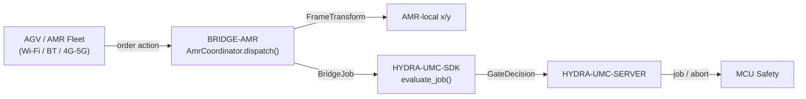

<!-- =============================================================================
HYDRA-UMC-BRIDGE-AMR - AGV/AMR fleet bidirectional coordination bridge
Copyright (C) 2026 JuanenRac (Electro Hobby 3D) <electrohobby3d@gmail.com>
GPL-3.0-or-later - see LICENSE
============================================================================= -->

<p align="center">
  
</p>

# 🚗 HYDRA-UMC-BRIDGE-AMR

<p align="center">🇺🇸 <b>English</b> | <a href="README_spa.md">🇪🇸 Español</a></p>

### 🔗 Dependency-Free Coordination Boundary Between HYDRA-UMC and AGV/AMR Fleets

<p align="left">
  
  
  
</p>

---

## 1. 🛠️ TECHNICAL OVERVIEW

**HYDRA-UMC-BRIDGE-AMR** is the bidirectional, high-level coordination boundary between HYDRA-UMC and an AGV/AMR (autonomous mobile robot) fleet, reachable over Wi-Fi, Bluetooth or a cellular (4G/5G) link. It does exactly two real things before a job reaches an AMR: resolves a factory-frame coordinate into that specific AMR's own local frame via a real, hand-checkable 2D rigid-body transform, and maps a job phase onto a minimal, VDA-5050-inspired order action. It has no navigation, localization or obstacle-avoidance logic of its own, and it cannot bypass HYDRA-UMC-SERVER, MCU limits, watchdogs or E-STOP.

It belongs to the **Mobile & Autonomous Bridges** family alongside `HYDRA-UMC-BRIDGE-DROIDS` and `HYDRA-UMC-BRIDGE-UAV`, and shares the same `HYDRA-UMC-SDK` job-and-safety contract as the stationary **External Automation Bridges** (CNC, LASER, OPENPNP, PRINTER3D, ROS2) - so no bridge, mobile or stationary, invents its own definition of "safe to work".

### Key Features:
* ✅ **Real, hand-checkable coordinate-frame transform:** `FrameTransform` maps a factory-frame `(x, y)` into a specific AMR's own local frame given that AMR's real origin/heading on the factory floor - verified with an identity case, a pure translation, a 90-degree heading rotation and a real round-trip test. *(implemented, tested in `tests/test_coordinator.py`)*
* ✅ **Real, VDA-5050-inspired order-action vocabulary:** `MOVE_TO_STAGING`, `PICK_LOAD`, `MOVE_TO_DESTINATION`, `DROP_LOAD`, `MOVE_TO_HOME`, `CANCEL_ORDER` - the last matching VDA 5050's own real action name for an order cancellation. *(implemented)*
* ✅ **Real per-action coordinate validation:** a movement action missing `x`/`y`, or carrying a non-numeric one, is rejected locally before the transform ever runs. *(implemented, tested)*
* ✅ **Real shared safety gate:** every job dispatched through `AmrCoordinator.dispatch()` is evaluated by `evaluate_job()` from `HYDRA-UMC-SDK`'s `bridge_contract`, the same gate every sibling bridge and HYDRA-UMC-SERVER use; a productive phase requires an `IDLE` external machine and a `READY` HYDRA-UMC cell, while `CANCEL_ORDER` remains requestable during a fault. *(implemented)*
* ✅ **Fail-closed phase routing and static evidence:** an unknown future SDK phase is denied. `inspect_order_plan.py` emits the static schema `1.0` order plan without opening any transport. *(implemented, tested)*
* ✅ **Non-mutating build/test:** `build-test.bat`/`.sh` compile the source and run deterministic unit tests without changing version or CHANGELOG. *(implemented, see BUILD & RUN below)*
* 🔜 **Real fleet-manager transport adapter** (a real VDA 5050 client, or a vendor-specific REST/WebSocket integration) - introduced only after a real fleet platform is selected and tested. *(planned)*

---

## 2. 🔄 AMR COORDINATION FLOW



---

## 3. 🧱 ARCHITECTURE & DESIGN DECISIONS

* **Why a real coordinate-frame transform lives here, and not just a pass-through.** HYDRA-UMC's own cell coordinates and any given AMR's local map rarely share an origin or heading - the pasted architecture note this project started from calls this out explicitly ("map factory-map coordinates onto the robot's own local map"). `FrameTransform` is the real, hand-verified math that closes that gap, kept as plain trigonometry with no fleet-manager dependency so it is testable anywhere.
* **Why the order-action vocabulary is shaped around VDA 5050.** VDA 5050 is the real, open, vendor-neutral fleet-integration standard several commercial AMR fleets (and a growing number of open-source stacks) already speak - naming this repo's own actions after its real vocabulary (`CANCEL_ORDER`, node/action-shaped movement) means a future real VDA 5050 adapter is a natural fit rather than a translation layer bolted on after the fact.
* **Why `AmrCoordinator.dispatch()` still funnels every job through the shared `evaluate_job()` gate.** An AMR is just another client of the same `bridge_contract` that CNC, LASER, OPENPNP, PRINTER3D, ROS2 and DROIDS use - it gets no special bypass of the IDLE/READY logic every other bridge and HYDRA-UMC-SERVER enforce.
* **Why `CANCEL_ORDER` stays requestable during a fault.** The gate's productive-phase requirement (`IDLE` + `READY`) is intentionally not applied the same way to an abort request - an operator must always be able to cancel an AMR's current order, even mid-fault.
* **Why the fleet-manager transport adapter is not in this repo yet.** Committing to one AMR's real REST/WebSocket protocol (or a full VDA 5050 MQTT client) before a real fleet is selected and tested would risk baking in assumptions this local, dependency-free core cannot verify.
* **How this fits the rest of the ecosystem.** BRIDGE-AMR sits between a real AMR fleet and `HYDRA-UMC-SDK` → `HYDRA-UMC-SERVER` → MCU safety - it is a coordination boundary, never a navigation or motor-control node, and it cannot bypass HYDRA-UMC-SERVER, MCU limits, watchdogs or E-STOP.

---

## 📂 DIRECTORY STRUCTURE

```text
HYDRA-UMC-BRIDGE-AMR/
├── src/
│   └── hydra_umc_bridge_amr/
│       ├── __init__.py
│       └── coordinator.py       # AmrCoordinator + FrameTransform: dependency-free order gate
├── tests/
│   └── test_coordinator.py      # Deterministic unit tests, incl. hand-checkable geometry
├── tools/
│   ├── build_test.py            # Non-mutating compile + test runner (build-test.bat/.sh)
│   ├── bump_version.py          # Synchronizes pyproject.toml, manifest and CHANGELOG.md
│   └── inspect_order_plan.py    # Prints the static order plan (no transport opened)
├── docs/
│   └── BRIDGE_GUIDE.md          # Scope, compatible platforms, scripts, hardware acceptance gate
├── build-test.bat / build-test.sh  # Validate only, never modifies the repository
├── build.bat / build.sh            # Validate, then bump version + CHANGELOG on success
├── pyproject.toml               # Package metadata; depends on HYDRA-UMC-SDK (git)
├── hydra-umc.project.json       # Ecosystem manifest (version, maturity, family)
├── CHANGELOG.md
├── CODE_OF_CONDUCT.md / CONTRIBUTING.md / SECURITY.md / SUPPORT.md
├── LICENSE / LICENSE.md
└── README.md / README_spa.md    # This file and its translation(s)
```

---

## 4. ⚙️ BUILD & RUN

Requires Python 3.11+. `tools/build_test.py` expects `HYDRA-UMC-SDK` checked out as a sibling directory (`../HYDRA-UMC-SDK`) or pointed at via the `HYDRA_UMC_SDK_ROOT` environment variable.

```bash
# Windows
build-test.bat      # validate only — no version/CHANGELOG change
build.bat            # validate, then bump version + CHANGELOG on success

# Linux/macOS
bash build-test.sh
bash build.sh
```

`build-test` compiles every module under `src/` with `py_compile` and runs the full `unittest` suite (`tests/test_coordinator.py`) - deterministically, with no real AMR connection, no network and no version/CHANGELOG change. `build` runs that same validation first and, only on success, calls `tools/bump_version.py` to synchronize the version across `pyproject.toml`, `hydra-umc.project.json` and `CHANGELOG.md`. There is no live hardware `run` command yet - that requires a validated fleet-manager transport adapter and a real AMR/fleet.

---

## ✅ Current Status & Next Steps

**Real today:** version `0.0.1`, functional as a dependency-free coordination core (`AmrCoordinator`) with a real, hand-verified coordinate-frame transform (`FrameTransform`), fail-closed phase routing, a static `plan-only` order schema, and non-mutating build-test scripts wired into CI with an SDK checkout.

**Integration boundary:** this bridge is a coordination boundary only - it is not a navigation or motor-control node, and it cannot bypass HYDRA-UMC-SERVER, MCU limits, watchdogs or E-STOP; every dispatched job still passes through the same shared gate every sibling bridge uses.

**Still ahead:** no real fleet-manager transport (VDA 5050, vendor REST/WebSocket) or physical AMR has been validated yet - a real adapter will be introduced only after a specific fleet platform is selected and tested.

---

## 🔗 Related Projects

This project is part of a larger robotics ecosystem by the same author (JuanenRac / Electro Hobby 3D), spanning firmware, control software, AI nodes and fleet tooling. Worth knowing about, since a request might actually be about one of these rather than this repository.

### Directly Related

- **[HYDRA-UMC-SDK](https://github.com/JuanenRac/HYDRA-UMC-SDK)** — the shared job-and-safety contract every bridge (including this one) evaluates jobs through.
- **[HYDRA-UMC-SERVER](https://github.com/JuanenRac/HYDRA-UMC-SERVER)** — the authenticated ecosystem boundary this bridge reports to.
- **[HYDRA-UMC-BRIDGE-DROIDS](https://github.com/JuanenRac/HYDRA-UMC-BRIDGE-DROIDS)** — sibling mobile bridge for legged/humanoid droids.
- **[HYDRA-UMC-BRIDGE-UAV](https://github.com/JuanenRac/HYDRA-UMC-BRIDGE-UAV)** — sibling mobile bridge for drones.

### Rest of the Ecosystem

**HYDRA-UMC platform** — the multi-robot micro-factory cell this bridge coordinates auxiliaries for
- **[HYDRA-UMC](https://github.com/JuanenRac/HYDRA-UMC)** — the CM5 + STM32H745 motherboard orchestrating up to 8 robot arms.
- **[HYDRA-UMC-SERVER](https://github.com/JuanenRac/HYDRA-UMC-SERVER)** — the Express/WebSocket backend every control client and bridge talks to.
- **[HYDRA-UMC-STUDIO](https://github.com/JuanenRac/HYDRA-UMC-STUDIO)** — web-based control dashboard, multi-robot 3D visualization.

**External Automation Bridges** — sibling repos sharing this same `HYDRA-UMC-SDK` job gate
- **[HYDRA-UMC-BRIDGE-CNC](https://github.com/JuanenRac/HYDRA-UMC-BRIDGE-CNC)** — CNC cell coordination bridge.
- **[HYDRA-UMC-BRIDGE-LASER](https://github.com/JuanenRac/HYDRA-UMC-BRIDGE-LASER)** — laser-cell coordination bridge.
- **[HYDRA-UMC-BRIDGE-OPENPNP](https://github.com/JuanenRac/HYDRA-UMC-BRIDGE-OPENPNP)** — board-flow bridge for OpenPnP.
- **[HYDRA-UMC-BRIDGE-PRINTER3D](https://github.com/JuanenRac/HYDRA-UMC-BRIDGE-PRINTER3D)** — coordination bridge for open 3D-printing software.
- **[HYDRA-UMC-BRIDGE-ROS2](https://github.com/JuanenRac/HYDRA-UMC-BRIDGE-ROS2)** — generic coordination bridge for any ROS 2 platform.

**Safety & Integration Evidence**
- **[HYDRA-UMC-SAFETY-ZONES](https://github.com/JuanenRac/HYDRA-UMC-SAFETY-ZONES)** — cell-zone safety evidence used across the bridge family.
- **[HYDRA-UMC-HIL-BRIDGE](https://github.com/JuanenRac/HYDRA-UMC-HIL-BRIDGE)** — hardware-in-the-loop test evidence.

## 👤 AUTHOR
**JuanenRac** (Electro Hobby 3D)
📧 electrohobby3d@gmail.com

## 📜 LICENSE
GPL-3.0 - See LICENSE for details.
