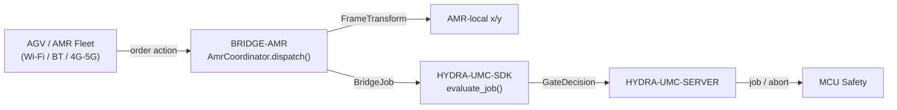

<!-- =============================================================================
HYDRA-UMC-BRIDGE-AMR - AGV/AMR fleet bidirectional coordination bridge
Copyright (C) 2026 JuanenRac (Electro Hobby 3D) <electrohobby3d@gmail.com>
GPL-3.0-or-later - see LICENSE
============================================================================= -->

<p align="center">
  
</p>

# 🚗 HYDRA-UMC-BRIDGE-AMR

<p align="center">🇺🇸 <b>English</b> | <a href="README_spa.md">🇪🇸 Español</a> | <a href="README_fra.md">🇫🇷 Français</a> | <a href="README_ita.md">🇮🇹 Italiano</a> | <a href="README_deu.md">🇩🇪 Deutsch</a> | <a href="README_zho.md">🇨🇳 简体中文</a> | <a href="README_jpn.md">🇯🇵 日本語</a></p>

### 🔗 Dependency-Free Coordination Boundary Between HYDRA-UMC and AGV/AMR Fleets

<p align="left">
  
  
  
</p>

---

## 1. 🛠️ TECHNICAL OVERVIEW

**HYDRA-UMC-BRIDGE-AMR** is the bidirectional, high-level coordination boundary between HYDRA-UMC and an AGV/AMR (autonomous mobile robot) fleet, reachable over Wi-Fi, Bluetooth or a cellular (4G/5G) link. It does exactly two real things before a job reaches an AMR: resolves a factory-frame coordinate into that specific AMR's own local frame via a real, hand-checkable 2D rigid-body transform, and maps a job phase onto a minimal, VDA-5050-inspired order action. It has no navigation, localization or obstacle-avoidance logic of its own, and it cannot bypass HYDRA-UMC-SERVER, MCU limits, watchdogs or E-STOP.

It belongs to the **Mobile & Autonomous Bridges** family alongside `HYDRA-UMC-BRIDGE-DROIDS` and `HYDRA-UMC-BRIDGE-UAV`, and shares the same `HYDRA-UMC-SDK` job-and-safety contract as the stationary **External Automation Bridges** (CNC, LASER, OPENPNP, PRINTER3D, ROS2) - so no bridge, mobile or stationary, invents its own definition of "safe to work".

### Key Features:
* ✅ **Real, hand-checkable coordinate-frame transform:** `FrameTransform` maps a factory-frame `(x, y)` into a specific AMR's own local frame given that AMR's real origin/heading on the factory floor - verified with an identity case, a pure translation, a 90-degree heading rotation and a real round-trip test. *(implemented, tested in `tests/test_coordinator.py`)*
* ✅ **Real, VDA-5050-inspired order-action vocabulary, on the real two-channel split:** `MOVE_TO_STAGING`, `PICK_LOAD`, `MOVE_TO_DESTINATION`, `DROP_LOAD`, `MOVE_TO_HOME` publish on the real VDA 5050 `order` topic (queued, part of a route); `CANCEL_ORDER` publishes on the real, separate `instantActions` topic (immediate, bypasses the order queue) - matching VDA 5050's own real `cancelOrder` action name AND its own real channel, checked against the [official schemas](https://github.com/VDA5050/VDA5050/tree/main/json_schemas). *(implemented)*
* ✅ **Real per-action coordinate validation:** a movement action missing `x`/`y`, or carrying a non-numeric one, is rejected locally before the transform ever runs. *(implemented, tested)*
* ✅ **Real shared safety gate:** every job dispatched through `AmrCoordinator.dispatch()` is evaluated by `evaluate_job()` from `HYDRA-UMC-SDK`'s `bridge_contract`, the same gate every sibling bridge and HYDRA-UMC-SERVER use; a productive phase requires an `IDLE` external machine and a `READY` HYDRA-UMC cell, while `CANCEL_ORDER` remains requestable during a fault. *(implemented)*
* ✅ **Fail-closed phase routing and static evidence:** an unknown future SDK phase is denied. `inspect_order_plan.py` emits the static schema `1.1` order plan (real `actions`/`instant_actions` channel split) without opening any transport. *(implemented, tested)*
* ✅ **Real VDA 5050 MQTT publisher:** `mqtt_transport.py`'s `Vda5050Publisher` sends an already-gated dispatch as a real, spec-shaped message on the correct real topic (`{interfaceName}/{majorVersion}/{manufacturer}/{serialNumber}/{order|instantActions}`) - a rejected dispatch never reaches the network. *(implemented, tested in `tests/test_mqtt_transport.py`)*
* ✅ **Non-mutating build/test:** `build-test.bat`/`.sh` compile the source and run deterministic unit tests without changing version or CHANGELOG. *(implemented, see BUILD & RUN below)*
* 🔜 **A vendor-specific fleet-manager REST/WebSocket adapter** (for a fleet platform that isn't VDA 5050-native) - introduced only after that platform is selected and tested. *(planned)*

---

## 2. 🔄 AMR COORDINATION FLOW



---

## 3. 🧱 ARCHITECTURE & DESIGN DECISIONS

* **Why a real coordinate-frame transform lives here, and not just a pass-through.** HYDRA-UMC's own cell coordinates and any given AMR's local map rarely share an origin or heading - the pasted architecture note this project started from calls this out explicitly ("map factory-map coordinates onto the robot's own local map"). `FrameTransform` is the real, hand-verified math that closes that gap, kept as plain trigonometry with no fleet-manager dependency so it is testable anywhere.
* **Why the order-action vocabulary is shaped around VDA 5050.** VDA 5050 is the real, open, vendor-neutral fleet-integration standard several commercial AMR fleets (and a growing number of open-source stacks) already speak - naming this repo's own actions after its real vocabulary (`CANCEL_ORDER`, node/action-shaped movement) means a future real VDA 5050 adapter is a natural fit rather than a translation layer bolted on after the fact.
* **Why `AmrCoordinator.dispatch()` still funnels every job through the shared `evaluate_job()` gate.** An AMR is just another client of the same `bridge_contract` that CNC, LASER, OPENPNP, PRINTER3D, ROS2 and DROIDS use - it gets no special bypass of the IDLE/READY logic every other bridge and HYDRA-UMC-SERVER enforce.
* **Why `CANCEL_ORDER` stays requestable during a fault.** The gate's productive-phase requirement (`IDLE` + `READY`) is intentionally not applied the same way to an abort request - an operator must always be able to cancel an AMR's current order, even mid-fault.
* **Why the fleet-manager transport adapter is not in this repo yet.** Committing to one AMR's real REST/WebSocket protocol (or a full VDA 5050 MQTT client) before a real fleet is selected and tested would risk baking in assumptions this local, dependency-free core cannot verify.
* **How this fits the rest of the ecosystem.** BRIDGE-AMR sits between a real AMR fleet and `HYDRA-UMC-SDK` → `HYDRA-UMC-SERVER` → MCU safety - it is a coordination boundary, never a navigation or motor-control node, and it cannot bypass HYDRA-UMC-SERVER, MCU limits, watchdogs or E-STOP.

---

## 📂 DIRECTORY STRUCTURE

```text
HYDRA-UMC-BRIDGE-AMR/
├── src/
│   └── hydra_umc_bridge_amr/
│       ├── __init__.py
│       ├── coordinator.py       # AmrCoordinator + FrameTransform: dependency-free order gate
│       └── mqtt_transport.py    # Real VDA 5050 MQTT publish - order/instantActions, gated dispatch only
├── tests/
│   ├── test_coordinator.py      # Deterministic unit tests, incl. hand-checkable geometry
│   └── test_mqtt_transport.py   # VDA 5050 topic/message shape tests against a fake MQTT client
├── tools/
│   ├── build_test.py            # Non-mutating compile + test runner (build-test.bat/.sh)
│   ├── bump_version.py          # Synchronizes pyproject.toml, manifest and CHANGELOG.md
│   └── inspect_order_plan.py    # Prints the static order plan (no transport opened)
├── docs/
│   └── BRIDGE_GUIDE.md          # Scope, compatible platforms, scripts, hardware acceptance gate
├── images/
│   └── HYDRA_UMC_BANNER.svg     # README banner
├── build-test.bat / build-test.sh  # Validate only, never modifies the repository
├── build.bat / build.sh            # Validate, then bump version + CHANGELOG on success
├── pyproject.toml               # Package metadata; depends on HYDRA-UMC-SDK (git)
├── hydra-umc.project.json       # Ecosystem manifest (version, maturity, family)
├── CHANGELOG.md
├── CODE_OF_CONDUCT.md / CONTRIBUTING.md / SECURITY.md / SUPPORT.md
├── LICENSE / LICENSE.md
└── README.md / README_*.md      # This file and its 6 translations
```

See [`docs/BRIDGE_GUIDE.md`](docs/BRIDGE_GUIDE.md) for the full scope and
operating model, compatible platforms, the scripts table, and the hardware
acceptance gate to walk through before pointing this bridge at a real fleet.

---

## 4. ⚙️ BUILD & RUN

Requires Python 3.11+. `tools/build_test.py` expects `HYDRA-UMC-SDK` checked out as a sibling directory (`../HYDRA-UMC-SDK`) or pointed at via the `HYDRA_UMC_SDK_ROOT` environment variable.

```bash
# Windows
build-test.bat      # validate only — no version/CHANGELOG change
build.bat            # validate, then bump version + CHANGELOG on success

# Linux/macOS
bash build-test.sh
bash build.sh
```

`build-test` compiles every module under `src/` with `py_compile` and runs the full `unittest` suite (`tests/test_coordinator.py`) - deterministically, with no real AMR connection, no network and no version/CHANGELOG change. `build` runs that same validation first and, only on success, calls `tools/bump_version.py` to synchronize the version across `pyproject.toml`, `hydra-umc.project.json` and `CHANGELOG.md`. There is no live hardware `run` command yet - that requires a validated fleet-manager transport adapter and a real AMR/fleet.

---

## ✅ Current Status & Next Steps

**Real today:** version `0.0.4`, functional as a dependency-free coordination core (`AmrCoordinator`) with a real, hand-verified coordinate-frame transform (`FrameTransform`), fail-closed phase routing, a static `plan-only` order schema with the real VDA 5050 order/instantActions channel split, a real VDA 5050 MQTT publisher (`Vda5050Publisher`), and non-mutating build-test scripts wired into CI with an SDK checkout.

**Integration boundary:** this bridge is a coordination boundary only - it is not a navigation or motor-control node, and it cannot bypass HYDRA-UMC-SERVER, MCU limits, watchdogs or E-STOP; every dispatched job still passes through the same shared gate every sibling bridge uses.

**Still ahead:** no real fleet-manager transport (VDA 5050, vendor REST/WebSocket) or physical AMR has been validated yet - a real adapter will be introduced only after a specific fleet platform is selected and tested.

---

## 🔗 Related Projects

This project is part of the HYDRA-UMC robotics ecosystem by the same author (JuanenRac / Electro Hobby 3D). Worth knowing about, since a request might actually be about one of these rather than this repository.

**Parent Project**
- **[HYDRA-UMC-SERVER](https://github.com/JuanenRac/HYDRA-UMC-SERVER)** — the real headless backend (REST/WebSocket) every control client actually talks to; the authenticated ecosystem boundary this bridge reports to once each command has cleared this bridge's own local safety gate.

**Sibling Projects** — also talk to HYDRA-UMC-SERVER's own API, each their own client
- **[HYDRA-UMC-STUDIO](https://github.com/JuanenRac/HYDRA-UMC-STUDIO)** — web control dashboard with real-time multi-robot 3D visualization.
- **[HYDRA-UMC-SUITE](https://github.com/JuanenRac/HYDRA-UMC-SUITE)** — desktop (PySide6) swarm command center for multiple servers at once, packaged as a standalone executable.
- **[HYDRA-UMC-ANDROID-CONTROL](https://github.com/JuanenRac/HYDRA-UMC-ANDROID-CONTROL)** — native Android control app with biometric login and a paired Wear OS companion.
- **[HYDRA-UMC-IOS-CONTROL](https://github.com/JuanenRac/HYDRA-UMC-IOS-CONTROL)** — iOS/iPadOS control app (Flutter) with real-time WebSocket sync.
- **[HYDRA-UMC-DSI](https://github.com/JuanenRac/HYDRA-UMC-DSI)** — native touch UI for the onboard 7" DSI touchscreen, embedded on the CM5 itself.
- **[HYDRA-UMC-BRIDGE-CNC](https://github.com/JuanenRac/HYDRA-UMC-BRIDGE-CNC)** — high-level CNC-cell coordinator with real GRBL status/control-byte access.
- **[HYDRA-UMC-BRIDGE-DROIDS](https://github.com/JuanenRac/HYDRA-UMC-BRIDGE-DROIDS)** — coordination boundary for legged/humanoid droids, with a real Boston Dynamics Spot command sender — one of the ecosystem's 3 mobile-fleet bridges.
- **[HYDRA-UMC-BRIDGE-LASER](https://github.com/JuanenRac/HYDRA-UMC-BRIDGE-LASER)** — laser-cell safety coordinator reading 3 real key/enclosure/interlock GPIO safeguards.
- **[HYDRA-UMC-BRIDGE-OPENPNP](https://github.com/JuanenRac/HYDRA-UMC-BRIDGE-OPENPNP)** — safe high-level board-flow coordinator for OpenPnP pick-and-place.
- **[HYDRA-UMC-BRIDGE-PRINTER3D](https://github.com/JuanenRac/HYDRA-UMC-BRIDGE-PRINTER3D)** — safe coordination boundary for Moonraker/Klipper 3D printers, with real gated job commands.
- **[HYDRA-UMC-BRIDGE-ROS2](https://github.com/JuanenRac/HYDRA-UMC-BRIDGE-ROS2)** — safety coordinator with a real, lazily-imported rclpy ROS 2 transport.
- **[HYDRA-UMC-BRIDGE-UAV](https://github.com/JuanenRac/HYDRA-UMC-BRIDGE-UAV)** — coordination boundary for camera-equipped UAVs, with a real MAVLink command sender — one of the ecosystem's 3 mobile-fleet bridges.

**Directly Related**
- **[HYDRA-UMC-SDK](https://github.com/JuanenRac/HYDRA-UMC-SDK)** — the shared JSON-Schema contract and safety-gate boundary every bridge validates its commands against.
- **[HYDRA-UMC-MQTT-BROKER](https://github.com/JuanenRac/HYDRA-UMC-MQTT-BROKER)** — `mqtt_transport.py`'s `Vda5050Publisher` sends every already-gated dispatch as a real, spec-shaped VDA 5050 `order`/`instantActions` message — unlike the other bridges' own `hydra/bridges/<name>/...` topic scheme, this one uses VDA 5050's own real topic shape directly.

**Also Part of the Ecosystem**

*Core Hardware & Platform*
- **[HYDRA-UMC](https://github.com/JuanenRac/HYDRA-UMC)** — the physical robot-arm motherboard: CM5 host + dual-core STM32H745, orchestrating up to 8 tool arms over CAN-OTA/SPI-OTA.
- **[HYDRA-UMC-OS](https://github.com/JuanenRac/HYDRA-UMC-OS)** — reproducible Raspberry Pi OS product layer for the CM5: read-only agent, validated config/profiles, WiFi first-contact provisioning.

*Core Backend & Clients*
- **[HYDRA-UMC-EDITOR-URDF](https://github.com/JuanenRac/HYDRA-UMC-EDITOR-URDF)** — desktop graphical URDF creator/editor that pushes finished models into STUDIO's own catalog.

*URTC Tool Platform*
- **[URTC](https://github.com/JuanenRac/URTC)** — firmware for the physical Universal Robot Tool Controller PCB, 25+ tool profiles over CAN bus.
- **[URTC-FLASHER](https://github.com/JuanenRac/URTC-FLASHER)** — desktop GUI flashing tool for URTC boards, CAN-OTA plus full-chip SWD/JTAG.
- **[URTC-TESTER](https://github.com/JuanenRac/URTC-TESTER)** — desktop live CAN-bus diagnostic tool for URTC boards, one panel per tool profile.
- **[URTC-WEB-STUDIO](https://github.com/JuanenRac/URTC-WEB-STUDIO)** — browser-based alternative to URTC-TESTER via the Web Serial API, no local install needed.

*Vision AI Node (Hailo-8)*
- **[HYDRA-UMC-VISION-NODE](https://github.com/JuanenRac/HYDRA-UMC-VISION-NODE)** — integration hub for the Hailo-8 vision pipeline, with a real per-stage hardware-readiness check.
- **[HYDRA-UMC-DETECTION-HEF](https://github.com/JuanenRac/HYDRA-UMC-DETECTION-HEF)** — real compiled-model registry with Hailo-architecture/checksum safe-load verification.
- **[HYDRA-UMC-VISION-STREAMER](https://github.com/JuanenRac/HYDRA-UMC-VISION-STREAMER)** — real GStreamer pipeline + MediaMTX config generator with a real HailoRT integration boundary.
- **[HYDRA-UMC-VISUAL-SERVOING-API](https://github.com/JuanenRac/HYDRA-UMC-VISUAL-SERVOING-API)** — real Position-Based Visual Servoing correction law, safety-gated on upstream zone state.
- **[HYDRA-UMC-SAFETY-ZONES](https://github.com/JuanenRac/HYDRA-UMC-SAFETY-ZONES)** — real zone-breach checking and E-STOP requesting, with calibration-freshness enforcement.

*Cognitive AI Node (Hailo-10)*
- **[HYDRA-UMC-COGNITIVE-NODE](https://github.com/JuanenRac/HYDRA-UMC-COGNITIVE-NODE)** — integration hub for the Hailo-10 cognitive pipeline (LLM/VLA/voice orchestration).
- **[HYDRA-UMC-VLA-ENGINE](https://github.com/JuanenRac/HYDRA-UMC-VLA-ENGINE)** — real action-token encoding/decoding and trajectory generation for a Vision-Language-Action model.
- **[HYDRA-UMC-VOICE-UI](https://github.com/JuanenRac/HYDRA-UMC-VOICE-UI)** — real voice front-end (VAD + intent parser) with a bounded, confirmation-gated Watch relay.
- **[HYDRA-UMC-SEMANTIC-PLANNER](https://github.com/JuanenRac/HYDRA-UMC-SEMANTIC-PLANNER)** — real rule-based task decomposition and semantic error recovery over MCU error codes.
- **[HYDRA-UMC-DOCS-QA](https://github.com/JuanenRac/HYDRA-UMC-DOCS-QA)** — real stdlib-only TF-IDF document search over this ecosystem's own Markdown docs.

*Orchestration & Swarm*
- **[HYDRA-UMC-ORCHESTRATOR](https://github.com/JuanenRac/HYDRA-UMC-ORCHESTRATOR)** — integration hub with a real gRPC/Protobuf health-report contract and mission state machine.
- **[HYDRA-UMC-JOB-DISPATCHER](https://github.com/JuanenRac/HYDRA-UMC-JOB-DISPATCHER)** — real priority-based job queue with deduplication, over a real HTTP API.
- **[HYDRA-UMC-NODE-HEALING](https://github.com/JuanenRac/HYDRA-UMC-NODE-HEALING)** — real gRPC-based fleet health watchdog with retry/backoff and identity-mismatch detection.
- **[HYDRA-UMC-PATH-PLANNER-3D](https://github.com/JuanenRac/HYDRA-UMC-PATH-PLANNER-3D)** — real RRT-based 3D path planner with real obstacle/workspace collision validation.
- **[HYDRA-UMC-SWARM-SYNC](https://github.com/JuanenRac/HYDRA-UMC-SWARM-SYNC)** — real CRDT LWW-Element-Map state sync, property-tested for multi-cell convergence.

*Digital Twin & Simulation*
- **[HYDRA-UMC-TWIN](https://github.com/JuanenRac/HYDRA-UMC-TWIN)** — integration hub for the digital-twin engine, with a real version-compatibility sync contract.
- **[HYDRA-UMC-HIL-BRIDGE](https://github.com/JuanenRac/HYDRA-UMC-HIL-BRIDGE)** — real hardware-in-the-loop safety interlock routing commands between simulation and real hardware.
- **[HYDRA-UMC-PHYSICS-REPLICA](https://github.com/JuanenRac/HYDRA-UMC-PHYSICS-REPLICA)** — real forward kinematics and joint-limit validation over a real URDF subset.
- **[HYDRA-UMC-SYNTHETIC-DATA-GEN](https://github.com/JuanenRac/HYDRA-UMC-SYNTHETIC-DATA-GEN)** — real procedural 2D scene generator with YOLO/COCO annotation export.

*Data & Analytics*
- **[HYDRA-UMC-DATALAKE](https://github.com/JuanenRac/HYDRA-UMC-DATALAKE)** — real sqlite3-backed time-series store with a real ingest/query HTTP API.
- **[HYDRA-UMC-ANOMALY-DETECTOR](https://github.com/JuanenRac/HYDRA-UMC-ANOMALY-DETECTOR)** — real FFT + statistical baseline anomaly detector with drift monitoring.
- **[HYDRA-UMC-PRODUCTION-REPORTS](https://github.com/JuanenRac/HYDRA-UMC-PRODUCTION-REPORTS)** — real OEE/availability calculation over DATALAKE history, with reproducible CSV export.
- **[HYDRA-UMC-TELEMETRY-COLLECTOR](https://github.com/JuanenRac/HYDRA-UMC-TELEMETRY-COLLECTOR)** — real CAN/WebSocket ingestion pipeline into DATALAKE, with sequence deduplication.

*Industrial Gateway*
- **[HYDRA-UMC-GATEWAY-INDUSTRIAL](https://github.com/JuanenRac/HYDRA-UMC-GATEWAY-INDUSTRIAL)** — integration hub relaying to industrial protocols, with a real command allowlist/backpressure layer.
- **[HYDRA-UMC-OPCUA-SERVER](https://github.com/JuanenRac/HYDRA-UMC-OPCUA-SERVER)** — real OPC-UA address space, verified with a real binary-protocol client session.
- **[HYDRA-UMC-MTCONNECT-ADAPTER](https://github.com/JuanenRac/HYDRA-UMC-MTCONNECT-ADAPTER)** — real MTConnect `/probe` and `/current` XML endpoints with degraded-mode output.

*Complementary Tools & Ecosystem Operations*
- **[HYDRA-UMC-DASHBOARD-AI](https://github.com/JuanenRac/HYDRA-UMC-DASHBOARD-AI)** — Smart Summaries and Anomaly Highlighting panels over DATALAKE/ANOMALY-DETECTOR, with an honest statistical fallback.
- **[HYDRA-UMC-TOOL-CLI](https://github.com/JuanenRac/HYDRA-UMC-TOOL-CLI)** — fleet CLI with a real, stable exit-code contract, a genuine live client of HYDRA-UMC-SERVER's own API.
- **[HYDRA-UMC-WATCH](https://github.com/JuanenRac/HYDRA-UMC-WATCH)** — WearOS companion app with real haptic alerts and a paired-phone voice relay.
- **[URTC-SMART-RACK](https://github.com/JuanenRac/URTC-SMART-RACK)** — firmware for a board-mounting rack with real tool-ID decoding and Smart Idle pre-heating logic.
- **[URTC-VISION-TOOL](https://github.com/JuanenRac/URTC-VISION-TOOL)** — firmware plus a real Python vision companion for a thermal/RGB inspection tool head.
- **[HYDRA-UMC-UPDATER](https://github.com/JuanenRac/HYDRA-UMC-UPDATER)** — administrative desktop tool that discovers, clones and updates every repo in this ecosystem.

---

## 📚 Documentation & Community

- **[CONTRIBUTING.md](CONTRIBUTING.md)** — tech stack and coding guidelines for a pull request.
- **[CODE_OF_CONDUCT.md](CODE_OF_CONDUCT.md)** — the standards of behavior expected in this community.
- **[SECURITY.md](SECURITY.md)** — how to report a vulnerability, and this project's own real security focus areas.
- **[SUPPORT.md](SUPPORT.md)** — where to ask questions and report bugs.
- **[LICENSE.md](LICENSE.md)** — this project's own license.

## 👤 AUTHOR
**JuanenRac** (Electro Hobby 3D)
📧 electrohobby3d@gmail.com
📺 [youtube.com/@electrohobby3d](https://youtube.com/@electrohobby3d)

## 📜 LICENSE
GPL-3.0 - See LICENSE for details.
