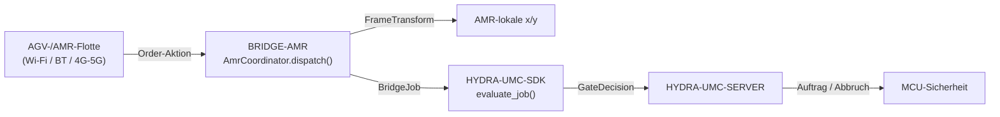

<!-- =============================================================================
HYDRA-UMC-BRIDGE-AMR - Bidirektionale Koordinationsbrücke für AGV-/AMR-Flotten
Copyright (C) 2026 JuanenRac (Electro Hobby 3D) <electrohobby3d@gmail.com>
GPL-3.0-or-later - see LICENSE
============================================================================= -->

<p align="center">
  
</p>

# 🚗 HYDRA-UMC-BRIDGE-AMR

<p align="center"><a href="README.md">🇺🇸 English</a> | <a href="README_spa.md">🇪🇸 Español</a> | <a href="README_fra.md">🇫🇷 Français</a> | <a href="README_ita.md">🇮🇹 Italiano</a> | 🇩🇪 <b>Deutsch</b> | <a href="README_zho.md">🇨🇳 简体中文</a> | <a href="README_jpn.md">🇯🇵 日本語</a></p>

### 🔗 Abhängigkeitsfreie Koordinationsgrenze zwischen HYDRA-UMC und AGV-/AMR-Flotten

<p align="left">
  
  
  
</p>

---

## 1. 🛠️ TECHNISCHER ÜBERBLICK

**HYDRA-UMC-BRIDGE-AMR** ist die bidirektionale, High-Level-Koordinationsgrenze zwischen HYDRA-UMC und einer AGV-/AMR-Flotte (autonomer mobiler Roboter), erreichbar über Wi-Fi, Bluetooth oder eine Mobilfunkverbindung (4G/5G). Sie tut genau zwei echte Dinge, bevor ein Auftrag einen AMR erreicht: Sie löst eine Koordinate aus dem Fabrik-Koordinatensystem mittels einer echten, von Hand nachprüfbaren 2D-Starrkörpertransformation in das eigene lokale Koordinatensystem dieses spezifischen AMR auf und bildet eine Auftragsphase auf eine minimale, an VDA 5050 angelehnte Order-Aktion ab. Sie hat keine eigene Navigations-, Lokalisierungs- oder Hindernisvermeidungslogik und kann HYDRA-UMC-SERVER, MCU-Grenzen, Watchdogs oder den E-STOP nicht umgehen.

Sie gehört zur Familie **Mobile & Autonomous Bridges** neben `HYDRA-UMC-BRIDGE-DROIDS` und `HYDRA-UMC-BRIDGE-UAV` und teilt denselben `HYDRA-UMC-SDK`-Auftrags- und Sicherheitsvertrag wie die stationären **External Automation Bridges** (CNC, LASER, OPENPNP, PRINTER3D, ROS2) — sodass keine Brücke, ob mobil oder stationär, ihre eigene Definition von "sicher zum Arbeiten" erfindet.

### Kernfunktionen:
* ✅ **Echte, von Hand nachprüfbare Koordinatensystem-Transformation:** `FrameTransform` bildet eine Koordinate `(x, y)` aus dem Fabrik-Koordinatensystem auf das eigene lokale Koordinatensystem eines bestimmten AMR ab, gegeben dessen echten Ursprung/Ausrichtung auf dem Fabrikboden — verifiziert mit einem Identitätsfall, einer reinen Translation, einer 90-Grad-Rotation der Ausrichtung und einem echten Hin- und Rücktransformationstest. *(implementiert, getestet in `tests/test_coordinator.py`)*
* ✅ **Echtes, an VDA 5050 angelehntes Order-Aktions-Vokabular:** `MOVE_TO_STAGING`, `PICK_LOAD`, `MOVE_TO_DESTINATION`, `DROP_LOAD`, `MOVE_TO_HOME`, `CANCEL_ORDER` — Letzteres entspricht dem echten Aktionsnamen von VDA 5050 für einen Auftragsabbruch. *(implementiert)*
* ✅ **Echte Koordinatenvalidierung pro Aktion:** eine Bewegungsaktion ohne `x`/`y` oder mit einem nicht-numerischen Wert wird lokal abgelehnt, bevor die Transformation überhaupt läuft. *(implementiert, getestet)*
* ✅ **Echtes gemeinsames Sicherheitsgatter:** jeder über `AmrCoordinator.dispatch()` versendete Auftrag wird durch `evaluate_job()` aus dem `bridge_contract` von `HYDRA-UMC-SDK` bewertet, demselben Gatter, das jede Schwesterbrücke und HYDRA-UMC-SERVER verwenden; eine produktive Phase erfordert eine externe Maschine im Zustand `IDLE` und eine `READY`-HYDRA-UMC-Zelle, während `CANCEL_ORDER` auch während eines Fehlers anforderbar bleibt. *(implementiert)*
* ✅ **Ausfallsicheres Phasenrouting und statische Evidenz:** eine unbekannte zukünftige SDK-Phase wird abgelehnt. `inspect_order_plan.py` gibt den statischen Order-Plan des Schemas `1.0` aus, ohne einen Transport zu öffnen. *(implementiert, getestet)*
* ✅ **Nicht-mutierender Build/Test:** `build-test.bat`/`.sh` kompilieren den Quellcode und führen deterministische Unit-Tests aus, ohne Version oder CHANGELOG zu ändern. *(implementiert, siehe BUILD & AUSFÜHRUNG unten)*
* 🔜 **Echter Transportadapter für Flottenmanager** (ein echter VDA-5050-Client oder eine herstellerspezifische REST-/WebSocket-Integration) — wird erst eingeführt, nachdem eine echte Flottenplattform ausgewählt und getestet wurde. *(geplant)*

---

## 2. 🔄 AMR-KOORDINATIONSABLAUF



---

## 3. 🧱 ARCHITEKTUR UND DESIGN-ENTSCHEIDUNGEN

* **Warum eine echte Koordinatensystem-Transformation hier lebt und nicht nur ein Durchreichen.** Die eigenen Zellkoordinaten von HYDRA-UMC und die lokale Karte eines gegebenen AMR teilen selten Ursprung oder Ausrichtung — die eingefügte Architektur-Notiz, von der dieses Projekt ausging, benennt das explizit ("Fabrikkarten-Koordinaten auf die eigene lokale Karte des Roboters abbilden"). `FrameTransform` ist die echte, von Hand verifizierte Mathematik, die diese Lücke schließt, gehalten als reine Trigonometrie ohne Flottenmanager-Abhängigkeit, sodass sie überall testbar ist.
* **Warum das Order-Aktions-Vokabular an VDA 5050 angelehnt ist.** VDA 5050 ist der echte, offene, herstellerneutrale Standard für Flottenintegration, den mehrere kommerzielle AMR-Flotten (und eine wachsende Zahl von Open-Source-Stacks) bereits sprechen — die eigenen Aktionen dieses Repos nach seinem echten Vokabular zu benennen (`CANCEL_ORDER`, knoten-/aktionsförmige Bewegung) bedeutet, dass ein künftiger echter VDA-5050-Adapter natürlich passt statt als nachträglich angeflanschte Übersetzungsschicht.
* **Warum `AmrCoordinator.dispatch()` trotzdem jeden Auftrag durch das gemeinsame `evaluate_job()`-Gatter leitet.** Ein AMR ist nur ein weiterer Client desselben `bridge_contract`, den CNC, LASER, OPENPNP, PRINTER3D, ROS2 und DROIDS verwenden — er erhält keine besondere Umgehung der IDLE/READY-Logik, die jede andere Brücke und HYDRA-UMC-SERVER durchsetzen.
* **Warum `CANCEL_ORDER` während eines Fehlers anforderbar bleibt.** Die Anforderung der produktiven Phase des Gatters (`IDLE` + `READY`) wird bewusst nicht in derselben Weise auf eine Abbruchanfrage angewendet — ein Bediener muss immer den aktuellen Auftrag eines AMR abbrechen können, selbst mitten in einem Fehler.
* **Warum der Transportadapter für den Flottenmanager noch nicht in diesem Repository ist.** Sich vor der Auswahl und dem Test einer echten Flotte auf das echte REST-/WebSocket-Protokoll eines bestimmten AMR (oder einen vollständigen VDA-5050-MQTT-Client) festzulegen, würde riskieren, Annahmen einzubauen, die dieser lokale, abhängigkeitsfreie Kern nicht verifizieren kann.
* **Wie das in den Rest des Ökosystems passt.** BRIDGE-AMR sitzt zwischen einer echten AMR-Flotte und `HYDRA-UMC-SDK` → `HYDRA-UMC-SERVER` → MCU-Sicherheit — es ist eine Koordinationsgrenze, niemals ein Navigations- oder Motorsteuerungsknoten, und es kann HYDRA-UMC-SERVER, MCU-Grenzen, Watchdogs oder den E-STOP nicht umgehen.

---

## 📂 VERZEICHNISSTRUKTUR

```text
HYDRA-UMC-BRIDGE-AMR/
├── src/
│   └── hydra_umc_bridge_amr/
│       ├── __init__.py
│       └── coordinator.py       # AmrCoordinator + FrameTransform: abhängigkeitsfreies Order-Gatter
├── tests/
│   └── test_coordinator.py      # Deterministische Unit-Tests, inkl. von Hand nachprüfbarer Geometrie
├── tools/
│   ├── build_test.py            # Nicht-mutierender Compiler + Testläufer (build-test.bat/.sh)
│   ├── bump_version.py          # Synchronisiert pyproject.toml, Manifest und CHANGELOG.md
│   └── inspect_order_plan.py    # Gibt den statischen Order-Plan aus (kein Transport geöffnet)
├── docs/
│   └── BRIDGE_GUIDE.md          # Umfang, kompatible Plattformen, Skripte, Hardware-Abnahmegatter
├── build-test.bat / build-test.sh  # Validiert nur, ändert das Repository nie
├── build.bat / build.sh            # Validiert und erhöht bei Erfolg Version + CHANGELOG
├── pyproject.toml               # Paket-Metadaten; hängt von HYDRA-UMC-SDK ab (git)
├── hydra-umc.project.json       # Ökosystem-Manifest (Version, Reifegrad, Familie)
├── CHANGELOG.md
├── CODE_OF_CONDUCT.md / CONTRIBUTING.md / SECURITY.md / SUPPORT.md
├── LICENSE / LICENSE.md
└── README.md / README_*.md      # Diese Datei und ihre 6 Übersetzungen
```

---

## 4. ⚙️ BUILD & AUSFÜHRUNG

Erfordert Python 3.11+. `tools/build_test.py` erwartet, dass `HYDRA-UMC-SDK` als Schwesterverzeichnis (`../HYDRA-UMC-SDK`) ausgecheckt oder über die Umgebungsvariable `HYDRA_UMC_SDK_ROOT` angegeben ist.

```bash
# Windows
build-test.bat      # nur Validierung — keine Versions-/CHANGELOG-Änderung
build.bat            # validiert und erhöht bei Erfolg Version + CHANGELOG

# Linux/macOS
bash build-test.sh
bash build.sh
```

`build-test` kompiliert jedes Modul unter `src/` mit `py_compile` und führt die vollständige `unittest`-Suite aus (`tests/test_coordinator.py`) — deterministisch, ohne echte AMR-Verbindung, ohne Netzwerk und ohne Versions-/CHANGELOG-Änderung. `build` führt zuerst dieselbe Validierung aus und ruft nur bei Erfolg `tools/bump_version.py` auf, um die Version in `pyproject.toml`, `hydra-umc.project.json` und `CHANGELOG.md` zu synchronisieren. Es gibt noch keinen echten Hardware-`run`-Befehl — dafür sind ein validierter Transportadapter für den Flottenmanager und eine echte AMR-Flotte erforderlich.

---

## ✅ Aktueller Status & Nächste Schritte

**Heute real:** Version `0.0.1`, funktionsfähig als abhängigkeitsfreier Koordinationskern (`AmrCoordinator`) mit einer echten, von Hand verifizierten Koordinatensystem-Transformation (`FrameTransform`), ausfallsicherem Phasenrouting, einem statischen `plan-only`-Order-Schema sowie nicht-mutierenden Build-Test-Skripten, die in CI mit SDK-Checkout eingebunden sind.

**Integrationsgrenze:** diese Brücke ist ausschließlich eine Koordinationsgrenze — sie ist kein Navigations- oder Motorsteuerungsknoten und kann HYDRA-UMC-SERVER, MCU-Grenzen, Watchdogs oder den E-STOP nicht umgehen; jeder versendete Auftrag durchläuft weiterhin dasselbe gemeinsame Gatter, das jede Schwesterbrücke verwendet.

**Noch offen:** es wurde noch kein echter Transport eines Flottenmanagers (VDA 5050, herstellerspezifisches REST/WebSocket) und kein physischer AMR validiert — ein echter Adapter wird erst eingeführt, nachdem eine bestimmte Flottenplattform ausgewählt und getestet wurde.

---

## 🔗 Verwandte Projekte

Dieses Projekt ist Teil eines größeren Robotik-Ökosystems desselben Autors (JuanenRac / Electro Hobby 3D), das Firmware, Steuerungssoftware, KI-Knoten und Flotten-Tooling umfasst. Es lohnt sich, das zu wissen, da eine Anfrage tatsächlich eines dieser Projekte betreffen könnte statt dieses Repositorys.

### Direkt verwandt

- **[HYDRA-UMC-SDK](https://github.com/JuanenRac/HYDRA-UMC-SDK)** — der gemeinsame Auftrags- und Sicherheitsvertrag, durch den jede Brücke (einschließlich dieser) ihre Aufträge bewertet.
- **[HYDRA-UMC-SERVER](https://github.com/JuanenRac/HYDRA-UMC-SERVER)** — die authentifizierte Ökosystemgrenze, an die diese Brücke berichtet.
- **[HYDRA-UMC-BRIDGE-DROIDS](https://github.com/JuanenRac/HYDRA-UMC-BRIDGE-DROIDS)** — Schwester-Mobilbrücke für laufende/humanoide Droiden.
- **[HYDRA-UMC-BRIDGE-UAV](https://github.com/JuanenRac/HYDRA-UMC-BRIDGE-UAV)** — Schwester-Mobilbrücke für Drohnen.

### Rest des Ökosystems

**HYDRA-UMC-Plattform** — die Multi-Roboter-Mikrofabrikzelle, für die diese Brücke Hilfsfunktionen koordiniert
- **[HYDRA-UMC](https://github.com/JuanenRac/HYDRA-UMC)** — die CM5- + STM32H745-Hauptplatine, die bis zu 8 Roboterarme orchestriert.
- **[HYDRA-UMC-SERVER](https://github.com/JuanenRac/HYDRA-UMC-SERVER)** — das Express/WebSocket-Backend, mit dem jeder Steuerungsclient und jede Brücke spricht.
- **[HYDRA-UMC-STUDIO](https://github.com/JuanenRac/HYDRA-UMC-STUDIO)** — webbasiertes Steuerungs-Dashboard, Multi-Roboter-3D-Visualisierung.

**External Automation Bridges** — Schwester-Repositories, die dasselbe `HYDRA-UMC-SDK`-Auftragsgatter teilen
- **[HYDRA-UMC-BRIDGE-CNC](https://github.com/JuanenRac/HYDRA-UMC-BRIDGE-CNC)** — CNC-Zellkoordinationsbrücke.
- **[HYDRA-UMC-BRIDGE-LASER](https://github.com/JuanenRac/HYDRA-UMC-BRIDGE-LASER)** — Koordinationsbrücke für Laserzellen.
- **[HYDRA-UMC-BRIDGE-OPENPNP](https://github.com/JuanenRac/HYDRA-UMC-BRIDGE-OPENPNP)** — Board-Flow-Brücke für OpenPnP.
- **[HYDRA-UMC-BRIDGE-PRINTER3D](https://github.com/JuanenRac/HYDRA-UMC-BRIDGE-PRINTER3D)** — Koordinationsbrücke für offene 3D-Drucksoftware.
- **[HYDRA-UMC-BRIDGE-ROS2](https://github.com/JuanenRac/HYDRA-UMC-BRIDGE-ROS2)** — generische Koordinationsbrücke für jede ROS-2-Plattform.

**Sicherheits- und Integrationsnachweise**
- **[HYDRA-UMC-SAFETY-ZONES](https://github.com/JuanenRac/HYDRA-UMC-SAFETY-ZONES)** — Sicherheitsnachweise für Zellzonen, die in der gesamten Brückenfamilie verwendet werden.
- **[HYDRA-UMC-HIL-BRIDGE](https://github.com/JuanenRac/HYDRA-UMC-HIL-BRIDGE)** — Hardware-in-the-Loop-Testnachweise.

## 👤 AUTOR
**JuanenRac** (Electro Hobby 3D)
📧 electrohobby3d@gmail.com
📺 [youtube.com/@electrohobby3d](https://youtube.com/@electrohobby3d)

## 📜 LIZENZ
GPL-3.0 - Siehe LICENSE für Details.
