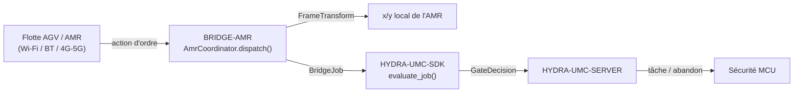

<!-- =============================================================================
HYDRA-UMC-BRIDGE-AMR - Pont de coordination bidirectionnel pour flottes AGV/AMR
Copyright (C) 2026 JuanenRac (Electro Hobby 3D) <electrohobby3d@gmail.com>
GPL-3.0-or-later - see LICENSE
============================================================================= -->

<p align="center">
  
</p>

# 🚗 HYDRA-UMC-BRIDGE-AMR

<p align="center"><a href="README.md">🇺🇸 English</a> | <a href="README_spa.md">🇪🇸 Español</a> | 🇫🇷 <b>Français</b> | <a href="README_ita.md">🇮🇹 Italiano</a> | <a href="README_deu.md">🇩🇪 Deutsch</a> | <a href="README_zho.md">🇨🇳 简体中文</a> | <a href="README_jpn.md">🇯🇵 日本語</a></p>

### 🔗 Frontière de coordination sans dépendance entre HYDRA-UMC et les flottes AGV/AMR

<p align="left">
  
  
  
</p>

---

## 1. 🛠️ APERÇU TECHNIQUE

**HYDRA-UMC-BRIDGE-AMR** est la frontière de coordination bidirectionnelle et haut niveau entre HYDRA-UMC et une flotte AGV/AMR (robot mobile autonome), accessible par Wi-Fi, Bluetooth ou une liaison cellulaire (4G/5G). Elle fait exactement deux choses réelles avant qu'une tâche n'atteigne un AMR : résoudre une coordonnée du repère usine vers le repère local propre de cet AMR au moyen d'une transformation rigide 2D réelle et vérifiable à la main, et mapper une phase de tâche vers une action d'ordre minimale inspirée de VDA 5050. Elle n'a aucune logique propre de navigation, de localisation ni d'évitement d'obstacles, et elle ne peut pas contourner HYDRA-UMC-SERVER, les limites du MCU, les watchdogs ou l'E-STOP.

Il appartient à la famille **Mobile & Autonomous Bridges**, aux côtés de `HYDRA-UMC-BRIDGE-DROIDS` et `HYDRA-UMC-BRIDGE-UAV`, et partage le même contrat de tâches et de sécurité `HYDRA-UMC-SDK` que les **External Automation Bridges** stationnaires (CNC, LASER, OPENPNP, PRINTER3D, ROS2).

### Fonctionnalités clés :
* ✅ **Transformation réelle de repère de coordonnées, vérifiable à la main :** `FrameTransform` mappe une coordonnée `(x, y)` du repère usine vers le repère local propre d'un AMR donné, à partir de l'origine et du cap réels de cet AMR sur le site — vérifiée par un cas identité, une translation pure, une rotation de cap de 90 degrés et un véritable test aller-retour. *(implémenté, testé dans `tests/test_coordinator.py`)*
* ✅ **Vocabulaire réel d'actions d'ordre inspiré de VDA 5050 :** `MOVE_TO_STAGING`, `PICK_LOAD`, `MOVE_TO_DESTINATION`, `DROP_LOAD`, `MOVE_TO_HOME`, `CANCEL_ORDER` — ce dernier correspond au nom réel de l'action VDA 5050 pour l'annulation d'un ordre. *(implémenté)*
* ✅ **Validation réelle des coordonnées par action :** une action de déplacement à laquelle il manque `x`/`y`, ou qui en porte une non numérique, est rejetée localement avant même que la transformation ne s'exécute. *(implémenté, testé)*
* ✅ **Portail de sécurité partagé, réel :** chaque tâche envoyée via `AmrCoordinator.dispatch()` est évaluée par `evaluate_job()` du `bridge_contract` de `HYDRA-UMC-SDK`, le même portail utilisé par tous les ponts frères et HYDRA-UMC-SERVER ; une phase productive nécessite une machine externe `IDLE` et une cellule HYDRA-UMC `READY`, tandis que `CANCEL_ORDER` reste demandable pendant un défaut. *(implémenté)*
* ✅ **Routage de phases fermé et évidence statique :** une future phase SDK inconnue est refusée. `inspect_order_plan.py` émet le plan d'ordre statique de schéma `1.0` sans ouvrir aucun transport. *(implémenté, testé)*
* ✅ **Éditeur MQTT VDA 5050 réel :** `Vda5050Publisher` de `mqtt_transport.py` envoie une répartition déjà validée sous forme de message réel, conforme au schéma, sur le bon topic réel (`{interfaceName}/{majorVersion}/{manufacturer}/{serialNumber}/{order|instantActions}`) - une répartition rejetée n'atteint jamais le réseau. *(implémenté, testé dans `tests/test_mqtt_transport.py`)*
* ✅ **Build/test non mutant :** `build-test.bat`/`.sh` compilent le code source et exécutent des tests unitaires déterministes sans changer la version ni le CHANGELOG. *(implémenté, voir COMPILATION ET EXÉCUTION ci-dessous)*
* 🔜 **Adaptateur REST/WebSocket propre à un gestionnaire de flotte** (pour une plateforme de flotte qui n'est pas nativement VDA 5050) — introduit seulement après la sélection et le test de cette plateforme. *(prévu)*

---

## 2. 🔄 FLUX DE COORDINATION DE L'AMR



---

## 3. 🧱 ARCHITECTURE ET CHOIX DE CONCEPTION

* **Pourquoi une transformation réelle de repère de coordonnées vit ici, et pas seulement un simple relais.** Les coordonnées propres de la cellule HYDRA-UMC et la carte locale d'un AMR donné partagent rarement une origine ou un cap — la note d'architecture collée dont ce projet est parti le signale explicitement (« mapper les coordonnées de la carte usine vers la carte locale propre du robot »). `FrameTransform` est la mathématique réelle, vérifiée à la main, qui comble cet écart, maintenue comme de la trigonométrie pure sans dépendance à un gestionnaire de flotte, afin d'être testable partout.
* **Pourquoi le vocabulaire d'actions d'ordre est calqué sur VDA 5050.** VDA 5050 est le standard réel, ouvert et neutre vis-à-vis des constructeurs pour l'intégration de flottes que plusieurs flottes AMR commerciales (et un nombre croissant de piles logicielles open source) parlent déjà — nommer les actions propres de ce dépôt d'après ce vocabulaire réel (`CANCEL_ORDER`, mouvement en forme de nœud/action) signifie qu'un futur adaptateur VDA 5050 réel s'intégrera naturellement, plutôt que de nécessiter une couche de traduction ajoutée après coup.
* **Pourquoi `AmrCoordinator.dispatch()` fait quand même passer chaque tâche par le portail partagé `evaluate_job()`.** Un AMR n'est qu'un client de plus du même `bridge_contract` utilisé par CNC, LASER, OPENPNP, PRINTER3D, ROS2 et DROIDS — il ne bénéficie d'aucun contournement spécial de la logique IDLE/READY appliquée par tous les autres ponts et par HYDRA-UMC-SERVER.
* **Pourquoi `CANCEL_ORDER` reste demandable pendant un défaut.** L'exigence de phase productive du portail (`IDLE` + `READY`) n'est délibérément pas appliquée de la même manière à une demande d'abandon — un opérateur doit toujours pouvoir annuler l'ordre en cours d'un AMR, même en plein défaut.
* **Pourquoi l'adaptateur de transport du gestionnaire de flotte n'est pas encore dans ce dépôt.** S'engager sur le protocole REST/WebSocket réel d'un AMR donné (ou sur un client MQTT VDA 5050 complet) avant qu'une flotte réelle ne soit sélectionnée et testée risquerait d'intégrer des hypothèses que ce noyau local sans dépendance ne peut pas vérifier.
* **Comment cela s'intègre dans le reste de l'écosystème.** BRIDGE-AMR se situe entre une flotte AMR réelle et `HYDRA-UMC-SDK` → `HYDRA-UMC-SERVER` → sécurité MCU : c'est une frontière de coordination, jamais un nœud de navigation ou de contrôle moteur, et elle ne peut pas contourner HYDRA-UMC-SERVER, les limites du MCU, les watchdogs ou l'E-STOP.

---

## 📂 STRUCTURE DES RÉPERTOIRES

```text
HYDRA-UMC-BRIDGE-AMR/
├── src/
│   └── hydra_umc_bridge_amr/
│       ├── __init__.py
│       └── coordinator.py       # AmrCoordinator + FrameTransform : portail d'ordre sans dépendance
├── tests/
│   └── test_coordinator.py      # Tests unitaires déterministes, incl. géométrie vérifiable à la main
├── tools/
│   ├── build_test.py            # Compilateur + lanceur de tests non mutant (build-test.bat/.sh)
│   ├── bump_version.py          # Synchronise pyproject.toml, manifeste et CHANGELOG.md
│   └── inspect_order_plan.py    # Affiche le plan d'ordre statique (aucun transport ouvert)
├── docs/
│   └── BRIDGE_GUIDE.md          # Portée, plateformes compatibles, scripts, portail d'acceptation matérielle
├── build-test.bat / build-test.sh  # Valide uniquement, ne modifie jamais le dépôt
├── build.bat / build.sh            # Valide puis, si succès, incrémente version + CHANGELOG
├── pyproject.toml               # Métadonnées du paquet ; dépend de HYDRA-UMC-SDK (git)
├── hydra-umc.project.json       # Manifeste de l'écosystème (version, maturité, famille)
├── CHANGELOG.md
├── CODE_OF_CONDUCT.md / CONTRIBUTING.md / SECURITY.md / SUPPORT.md
├── LICENSE / LICENSE.md
└── README.md / README_*.md      # Ce fichier et ses 6 traductions
```

---

## 4. ⚙️ COMPILATION ET EXÉCUTION

Nécessite Python 3.11+. `tools/build_test.py` attend que `HYDRA-UMC-SDK` soit cloné en tant que répertoire frère (`../HYDRA-UMC-SDK`) ou indiqué via la variable d'environnement `HYDRA_UMC_SDK_ROOT`.

```bash
# Windows
build-test.bat      # validation uniquement — pas de changement de version/CHANGELOG
build.bat            # valide puis, si succès, incrémente version + CHANGELOG

# Linux/macOS
bash build-test.sh
bash build.sh
```

`build-test` compile chaque module sous `src/` avec `py_compile` et exécute la suite complète `unittest` (`tests/test_coordinator.py`) — de manière déterministe, sans connexion réelle à un AMR, sans réseau et sans changement de version/CHANGELOG. `build` exécute d'abord cette même validation et, seulement en cas de succès, appelle `tools/bump_version.py` pour synchroniser la version dans `pyproject.toml`, `hydra-umc.project.json` et `CHANGELOG.md`. Il n'existe pas encore de commande `run` avec matériel réel — cela nécessite un adaptateur de transport de gestionnaire de flotte validé et une flotte/AMR réelle.

---

## ✅ État actuel et prochaines étapes

**Réel aujourd'hui :** version `0.0.1`, fonctionnel en tant que noyau de coordination sans dépendance (`AmrCoordinator`) avec une transformation réelle de repère de coordonnées vérifiée à la main (`FrameTransform`), un routage de phases fermé, un schéma d'ordre statique `plan-only`, et des scripts build-test non mutants intégrés en CI avec un checkout du SDK.

**Frontière d'intégration :** ce pont n'est qu'une frontière de coordination — ce n'est pas un nœud de navigation ni de contrôle moteur, et il ne peut pas contourner HYDRA-UMC-SERVER, les limites du MCU, les watchdogs ou l'E-STOP ; chaque tâche envoyée passe toujours par le même portail partagé utilisé par tous les ponts frères.

**Encore à venir :** aucun transport réel de gestionnaire de flotte (VDA 5050, REST/WebSocket propre à un constructeur) ni AMR physique n'a encore été validé — un adaptateur réel sera introduit seulement après la sélection et le test d'une plateforme de flotte spécifique.

---

## 🔗 Projets liés

Ce projet fait partie d'un écosystème robotique plus large du même auteur (JuanenRac / Electro Hobby 3D), couvrant firmware, logiciel de contrôle, nœuds d'IA et outillage de flotte.

### Directement liés

- **[HYDRA-UMC-SDK](https://github.com/JuanenRac/HYDRA-UMC-SDK)** — le contrat partagé de tâches et de sécurité par lequel chaque pont (y compris celui-ci) évalue ses tâches.
- **[HYDRA-UMC-SERVER](https://github.com/JuanenRac/HYDRA-UMC-SERVER)** — la frontière authentifiée de l'écosystème à laquelle ce pont rend compte.
- **[HYDRA-UMC-MQTT-BROKER](https://github.com/JuanenRac/HYDRA-UMC-MQTT-BROKER)** — `Vda5050Publisher` de `mqtt_transport.py` envoie ici chaque répartition déjà validée comme un vrai message VDA 5050 `order`/`instantActions` conforme au schéma - contrairement au schéma de topics `hydra/bridges/<nom>/...` des 5 ponts stationnaires, celui-ci utilise directement le schéma de topics réel propre à VDA 5050.
- **[HYDRA-UMC-BRIDGE-DROIDS](https://github.com/JuanenRac/HYDRA-UMC-BRIDGE-DROIDS)** — pont mobile frère pour droïdes à pattes/humanoïdes.
- **[HYDRA-UMC-BRIDGE-UAV](https://github.com/JuanenRac/HYDRA-UMC-BRIDGE-UAV)** — pont mobile frère pour les drones.

### Reste de l'écosystème

**Plateforme HYDRA-UMC** — la micro-usine multi-robot pour laquelle ce pont coordonne les auxiliaires
- **[HYDRA-UMC](https://github.com/JuanenRac/HYDRA-UMC)** — la carte mère CM5 + STM32H745 orchestrant jusqu'à 8 bras robotiques.
- **[HYDRA-UMC-SERVER](https://github.com/JuanenRac/HYDRA-UMC-SERVER)** — le backend Express/WebSocket auquel parlent tous les clients de contrôle et ponts.
- **[HYDRA-UMC-STUDIO](https://github.com/JuanenRac/HYDRA-UMC-STUDIO)** — tableau de bord web, visualisation 3D multi-robot.

**External Automation Bridges** — dépôts frères partageant ce même portail de tâches `HYDRA-UMC-SDK`
- **[HYDRA-UMC-BRIDGE-CNC](https://github.com/JuanenRac/HYDRA-UMC-BRIDGE-CNC)** — pont de coordination de cellule CNC.
- **[HYDRA-UMC-BRIDGE-LASER](https://github.com/JuanenRac/HYDRA-UMC-BRIDGE-LASER)** — pont de coordination de cellules laser.
- **[HYDRA-UMC-BRIDGE-OPENPNP](https://github.com/JuanenRac/HYDRA-UMC-BRIDGE-OPENPNP)** — pont de flux de cartes pour OpenPnP.
- **[HYDRA-UMC-BRIDGE-PRINTER3D](https://github.com/JuanenRac/HYDRA-UMC-BRIDGE-PRINTER3D)** — pont de coordination pour logiciels d'impression 3D ouverts.
- **[HYDRA-UMC-BRIDGE-ROS2](https://github.com/JuanenRac/HYDRA-UMC-BRIDGE-ROS2)** — pont de coordination générique pour toute plateforme ROS 2.

**Preuves de sécurité et d'intégration**
- **[HYDRA-UMC-SAFETY-ZONES](https://github.com/JuanenRac/HYDRA-UMC-SAFETY-ZONES)** — preuves de sécurité des zones de cellule utilisées dans toute la famille de ponts.
- **[HYDRA-UMC-HIL-BRIDGE](https://github.com/JuanenRac/HYDRA-UMC-HIL-BRIDGE)** — preuves de tests hardware-in-the-loop.

## 👤 AUTEUR
**JuanenRac** (Electro Hobby 3D)
📧 electrohobby3d@gmail.com
📺 [youtube.com/@electrohobby3d](https://youtube.com/@electrohobby3d)

## 📜 LICENCE
GPL-3.0 - Voir LICENSE pour les détails.
