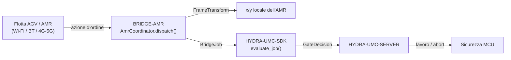

<!-- =============================================================================
HYDRA-UMC-BRIDGE-AMR - Ponte di coordinamento bidirezionale per flotte AGV/AMR
Copyright (C) 2026 JuanenRac (Electro Hobby 3D) <electrohobby3d@gmail.com>
GPL-3.0-or-later - see LICENSE
============================================================================= -->

<p align="center">
  
</p>

# 🚗 HYDRA-UMC-BRIDGE-AMR

<p align="center"><a href="README.md">🇺🇸 English</a> | <a href="README_spa.md">🇪🇸 Español</a> | <a href="README_fra.md">🇫🇷 Français</a> | 🇮🇹 <b>Italiano</b> | <a href="README_deu.md">🇩🇪 Deutsch</a> | <a href="README_zho.md">🇨🇳 简体中文</a> | <a href="README_jpn.md">🇯🇵 日本語</a></p>

### 🔗 Confine di coordinamento privo di dipendenze tra HYDRA-UMC e le flotte AGV/AMR

<p align="left">
  
  
  
</p>

---

## 1. 🛠️ PANORAMICA TECNICA

**HYDRA-UMC-BRIDGE-AMR** è il confine di coordinamento bidirezionale e di alto livello tra HYDRA-UMC e una flotta AGV/AMR (robot mobile autonomo), raggiungibile via Wi-Fi, Bluetooth o un collegamento cellulare (4G/5G). Fa esattamente due cose reali prima che un lavoro raggiunga un AMR: risolve una coordinata del sistema di riferimento di fabbrica nel sistema di riferimento locale proprio di quello specifico AMR tramite una trasformazione rigida 2D reale e verificabile a mano, e mappa una fase di lavoro su un'azione d'ordine minima ispirata a VDA 5050. Non ha alcuna logica propria di navigazione, localizzazione o evitamento ostacoli, e non può aggirare HYDRA-UMC-SERVER, i limiti dell'MCU, i watchdog o l'E-STOP.

Appartiene alla famiglia **Mobile & Autonomous Bridges** insieme a `HYDRA-UMC-BRIDGE-DROIDS` e `HYDRA-UMC-BRIDGE-UAV`, e condivide lo stesso contratto di lavoro e sicurezza `HYDRA-UMC-SDK` degli **External Automation Bridges** stazionari (CNC, LASER, OPENPNP, PRINTER3D, ROS2) - così nessun ponte, mobile o stazionario, inventa una propria definizione di "sicuro per lavorare".

### Caratteristiche principali:
* ✅ **Trasformazione reale di sistema di riferimento, verificabile a mano:** `FrameTransform` mappa una coordinata `(x, y)` del sistema di riferimento di fabbrica nel sistema di riferimento locale proprio di un AMR specifico, date l'origine e l'orientamento reali di quell'AMR sul pavimento di fabbrica - verificata con un caso identità, una traslazione pura, una rotazione di 90 gradi e un vero test di andata e ritorno. *(implementato, testato in `tests/test_coordinator.py`)*
* ✅ **Vocabolario reale di azioni d'ordine ispirato a VDA 5050:** `MOVE_TO_STAGING`, `PICK_LOAD`, `MOVE_TO_DESTINATION`, `DROP_LOAD`, `MOVE_TO_HOME`, `CANCEL_ORDER` - quest'ultimo corrisponde al nome reale dell'azione di VDA 5050 per l'annullamento di un ordine. *(implementato)*
* ✅ **Validazione reale delle coordinate per azione:** un'azione di movimento a cui mancano `x`/`y`, o che ne porta uno non numerico, viene rifiutata localmente prima che la trasformazione venga mai eseguita. *(implementato, testato)*
* ✅ **Porta di sicurezza condivisa, reale:** ogni lavoro inviato tramite `AmrCoordinator.dispatch()` viene valutato da `evaluate_job()` del `bridge_contract` di `HYDRA-UMC-SDK`, la stessa porta usata da tutti i ponti fratelli e da HYDRA-UMC-SERVER; una fase produttiva richiede una macchina esterna `IDLE` e una cella HYDRA-UMC `READY`, mentre `CANCEL_ORDER` resta richiedibile durante un guasto. *(implementato)*
* ✅ **Instradamento delle fasi chiuso ed evidenza statica:** una futura fase SDK sconosciuta viene negata. `inspect_order_plan.py` emette il piano d'ordine statico di schema `1.0` senza aprire alcun trasporto. *(implementato, testato)*
* ✅ **Publisher MQTT VDA 5050 reale:** `Vda5050Publisher` di `mqtt_transport.py` invia un dispatch già validato come messaggio reale, conforme allo schema, sul topic reale corretto (`{interfaceName}/{majorVersion}/{manufacturer}/{serialNumber}/{order|instantActions}`) - un dispatch rifiutato non raggiunge mai la rete. *(implementato, testato in `tests/test_mqtt_transport.py`)*
* ✅ **Build/test non mutante:** `build-test.bat`/`.sh` compilano il codice sorgente ed eseguono test unitari deterministici senza cambiare versione o CHANGELOG. *(implementato, vedi COMPILAZIONE ED ESECUZIONE più sotto)*
* 🔜 **Adattatore REST/WebSocket specifico di un gestore di flotta** (per una piattaforma di flotta non nativa VDA 5050) - introdotto solo dopo che quella piattaforma sarà selezionata e testata. *(pianificato)*

---

## 2. 🔄 FLUSSO DI COORDINAMENTO DELL'AMR



---

## 3. 🧱 ARCHITETTURA E DECISIONI DI PROGETTAZIONE

* **Perché qui vive una trasformazione reale di sistema di riferimento, e non un semplice passaggio diretto.** Le coordinate proprie della cella HYDRA-UMC e la mappa locale di un dato AMR raramente condividono origine o orientamento - la nota di architettura incollata da cui è partito questo progetto lo segnala esplicitamente ("mappare le coordinate della mappa di fabbrica sulla mappa locale propria del robot"). `FrameTransform` è la matematica reale, verificata a mano, che colma questo divario, mantenuta come pura trigonometria senza alcuna dipendenza dal gestore di flotta, così da essere testabile ovunque.
* **Perché il vocabolario di azioni d'ordine è modellato su VDA 5050.** VDA 5050 è lo standard reale, aperto e neutrale rispetto al produttore per l'integrazione di flotte già parlato da diverse flotte AMR commerciali (e da un numero crescente di stack open source) - nominare le azioni proprie di questo repository secondo il suo vocabolario reale (`CANCEL_ORDER`, movimento con forma nodo/azione) significa che un futuro adattatore VDA 5050 reale si inserirà in modo naturale invece di richiedere uno strato di traduzione aggiunto in seguito.
* **Perché `AmrCoordinator.dispatch()` incanala comunque ogni lavoro attraverso la porta condivisa `evaluate_job()`.** Un AMR è semplicemente un altro client dello stesso `bridge_contract` usato da CNC, LASER, OPENPNP, PRINTER3D, ROS2 e DROIDS - non ottiene alcun bypass speciale della logica IDLE/READY applicata da tutti gli altri ponti e da HYDRA-UMC-SERVER.
* **Perché `CANCEL_ORDER` resta richiedibile durante un guasto.** Il requisito di fase produttiva della porta (`IDLE` + `READY`) non viene deliberatamente applicato allo stesso modo a una richiesta di abort - un operatore deve sempre poter annullare l'ordine corrente di un AMR, anche in pieno guasto.
* **Perché l'adattatore di trasporto del gestore di flotta non è ancora in questo repository.** Vincolarsi al protocollo REST/WebSocket reale di un AMR specifico (o a un client MQTT completo per VDA 5050) prima che una flotta reale sia selezionata e testata rischierebbe di incorporare ipotesi che questo nucleo locale privo di dipendenze non può verificare.
* **Come si inserisce nel resto dell'ecosistema.** BRIDGE-AMR si trova tra una flotta AMR reale e `HYDRA-UMC-SDK` → `HYDRA-UMC-SERVER` → sicurezza MCU - è un confine di coordinamento, mai un nodo di navigazione o di controllo motore, e non può aggirare HYDRA-UMC-SERVER, i limiti dell'MCU, i watchdog o l'E-STOP.

---

## 📂 STRUTTURA DELLE DIRECTORY

```text
HYDRA-UMC-BRIDGE-AMR/
├── src/
│   └── hydra_umc_bridge_amr/
│       ├── __init__.py
│       ├── coordinator.py       # AmrCoordinator + FrameTransform: porta d'ordine priva di dipendenze
│       └── mqtt_transport.py    # Publish MQTT VDA 5050 reale - order/instantActions, solo dispatch già validato
├── tests/
│   ├── test_coordinator.py      # Test unitari deterministici, incl. geometria verificabile a mano
│   └── test_mqtt_transport.py   # Test di forma topic/messaggio VDA 5050 contro un client MQTT fittizio
├── tools/
│   ├── build_test.py            # Compilatore + esecutore di test non mutante (build-test.bat/.sh)
│   ├── bump_version.py          # Sincronizza pyproject.toml, manifesto e CHANGELOG.md
│   └── inspect_order_plan.py    # Stampa il piano d'ordine statico (nessun trasporto aperto)
├── docs/
│   └── BRIDGE_GUIDE.md          # Ambito, piattaforme compatibili, script, porta di accettazione hardware
├── images/
│   └── HYDRA_UMC_BANNER.svg     # Banner del README
├── build-test.bat / build-test.sh  # Solo valida, non modifica mai il repository
├── build.bat / build.sh            # Valida e, solo in caso di successo, aggiorna versione + CHANGELOG
├── pyproject.toml               # Metadati del pacchetto; dipende da HYDRA-UMC-SDK (git)
├── hydra-umc.project.json       # Manifesto dell'ecosistema (versione, maturità, famiglia)
├── CHANGELOG.md
├── CODE_OF_CONDUCT.md / CONTRIBUTING.md / SECURITY.md / SUPPORT.md
├── LICENSE / LICENSE.md
└── README.md / README_*.md      # Questo file e le sue 6 traduzioni
```

---

## 4. ⚙️ COMPILAZIONE ED ESECUZIONE

Richiede Python 3.11+. `tools/build_test.py` si aspetta che `HYDRA-UMC-SDK` sia clonato come directory fratella (`../HYDRA-UMC-SDK`) o indicato tramite la variabile d'ambiente `HYDRA_UMC_SDK_ROOT`.

```bash
# Windows
build-test.bat      # solo validazione — nessun cambio di versione/CHANGELOG
build.bat            # valida e, se ha successo, aggiorna versione + CHANGELOG

# Linux/macOS
bash build-test.sh
bash build.sh
```

`build-test` compila ogni modulo sotto `src/` con `py_compile` ed esegue l'intera suite `unittest` (`tests/test_coordinator.py`) - in modo deterministico, senza connessione reale a un AMR, senza rete e senza cambio di versione/CHANGELOG. `build` esegue prima quella stessa validazione e, solo in caso di successo, chiama `tools/bump_version.py` per sincronizzare la versione tra `pyproject.toml`, `hydra-umc.project.json` e `CHANGELOG.md`. Non esiste ancora un comando `run` con hardware reale - serve un adattatore di trasporto del gestore di flotta validato e un AMR/flotta reale.

---

## ✅ Stato attuale e prossimi passi

**Reale oggi:** versione `0.0.4`, funzionale come nucleo di coordinamento privo di dipendenze (`AmrCoordinator`) con una trasformazione reale di sistema di riferimento verificata a mano (`FrameTransform`), instradamento delle fasi chiuso, uno schema d'ordine statico `plan-only` con la vera separazione di canali order/instantActions di VDA 5050, un publisher MQTT VDA 5050 reale (`Vda5050Publisher`), e script build-test non mutanti collegati alla CI con un checkout dell'SDK.

**Confine di integrazione:** questo ponte è solo un confine di coordinamento - non è un nodo di navigazione né di controllo motore, e non può aggirare HYDRA-UMC-SERVER, i limiti dell'MCU, i watchdog o l'E-STOP; ogni lavoro inviato passa comunque attraverso la stessa porta condivisa usata da tutti i ponti fratelli.

**Ancora da fare:** nessun trasporto reale del gestore di flotta (VDA 5050, REST/WebSocket del produttore) né un AMR fisico è ancora stato validato - un adattatore reale sarà introdotto solo dopo che una piattaforma di flotta specifica sarà selezionata e testata.

---

## 🔗 Progetti Correlati

Questo progetto fa parte dell'ecosistema robotico HYDRA-UMC dello stesso autore (JuanenRac / Electro Hobby 3D). Vale la pena conoscerlo, poiché una richiesta potrebbe in realtà riguardare uno di questi invece di questo repository.

**Progetto Padre**
- **[HYDRA-UMC-SERVER](https://github.com/JuanenRac/HYDRA-UMC-SERVER)** — il vero backend headless (REST/WebSocket) con cui parla davvero ogni client di controllo; il confine autenticato dell'ecosistema a cui questo bridge riporta una volta che ogni comando ha superato la barriera di sicurezza locale di questo stesso bridge.

**Progetti Fratelli** — parlano anch'essi con la stessa API di HYDRA-UMC-SERVER, ciascuno come proprio client
- **[HYDRA-UMC-STUDIO](https://github.com/JuanenRac/HYDRA-UMC-STUDIO)** — dashboard di controllo web con visualizzazione 3D multi-robot in tempo reale.
- **[HYDRA-UMC-SUITE](https://github.com/JuanenRac/HYDRA-UMC-SUITE)** — centro di comando sciame desktop (PySide6) per più server contemporaneamente, pacchettizzato come eseguibile standalone.
- **[HYDRA-UMC-ANDROID-CONTROL](https://github.com/JuanenRac/HYDRA-UMC-ANDROID-CONTROL)** — app di controllo nativa per Android con login biometrico e un companion Wear OS abbinato.
- **[HYDRA-UMC-IOS-CONTROL](https://github.com/JuanenRac/HYDRA-UMC-IOS-CONTROL)** — app di controllo per iOS/iPadOS (Flutter) con sincronizzazione WebSocket in tempo reale.
- **[HYDRA-UMC-DSI](https://github.com/JuanenRac/HYDRA-UMC-DSI)** — interfaccia touch nativa per il touchscreen DSI da 7" a bordo, incorporata direttamente nel CM5.
- **[HYDRA-UMC-BRIDGE-CNC](https://github.com/JuanenRac/HYDRA-UMC-BRIDGE-CNC)** — coordinatore ad alto livello per celle CNC con accesso reale a stato/byte di controllo GRBL.
- **[HYDRA-UMC-BRIDGE-DROIDS](https://github.com/JuanenRac/HYDRA-UMC-BRIDGE-DROIDS)** — barriera di coordinamento per droidi con zampe/umanoidi, con un vero mittente di comandi per Boston Dynamics Spot — uno dei 3 bridge per flotte mobili dell'ecosistema.
- **[HYDRA-UMC-BRIDGE-LASER](https://github.com/JuanenRac/HYDRA-UMC-BRIDGE-LASER)** — coordinatore di sicurezza per celle laser che legge 3 salvaguardie GPIO reali di chiave/involucro/interblocco.
- **[HYDRA-UMC-BRIDGE-OPENPNP](https://github.com/JuanenRac/HYDRA-UMC-BRIDGE-OPENPNP)** — coordinatore ad alto livello sicuro per il flusso schede del pick-and-place OpenPnP.
- **[HYDRA-UMC-BRIDGE-PRINTER3D](https://github.com/JuanenRac/HYDRA-UMC-BRIDGE-PRINTER3D)** — barriera di coordinamento sicura per stampanti 3D Moonraker/Klipper, con comandi di lavoro reali e controllati.
- **[HYDRA-UMC-BRIDGE-ROS2](https://github.com/JuanenRac/HYDRA-UMC-BRIDGE-ROS2)** — coordinatore di sicurezza con un vero trasporto ROS 2 rclpy, importato in modo lazy.
- **[HYDRA-UMC-BRIDGE-UAV](https://github.com/JuanenRac/HYDRA-UMC-BRIDGE-UAV)** — barriera di coordinamento per UAV dotati di fotocamera, con un vero mittente di comandi MAVLink — uno dei 3 bridge per flotte mobili dell'ecosistema.

**Direttamente Correlati**
- **[HYDRA-UMC-SDK](https://github.com/JuanenRac/HYDRA-UMC-SDK)** — il contratto JSON-Schema condiviso e la barriera di sicurezza contro cui ogni bridge valida i propri comandi.
- **[HYDRA-UMC-MQTT-BROKER](https://github.com/JuanenRac/HYDRA-UMC-MQTT-BROKER)** — il `Vda5050Publisher` di `mqtt_transport.py` invia ogni dispatch già validato come un vero messaggio VDA 5050 `order`/`instantActions` conforme alla specifica — a differenza dello schema di topic `hydra/bridges/<nome>/...` proprio degli altri bridge, questo usa direttamente la vera forma di topic di VDA 5050.

**Fa Anche Parte dell'Ecosistema**

*Hardware e Piattaforma di Base*
- **[HYDRA-UMC](https://github.com/JuanenRac/HYDRA-UMC)** — la scheda madre fisica del braccio robotico: host CM5 + coprocessore STM32H745 dual-core, che coordina fino a 8 bracci utensile via CAN-OTA/SPI-OTA.
- **[HYDRA-UMC-OS](https://github.com/JuanenRac/HYDRA-UMC-OS)** — livello prodotto riproducibile su Raspberry Pi OS per il CM5: agente in sola lettura, config/profili validati, provisioning WiFi al primo contatto.

*Backend Centrale e Client*
- **[HYDRA-UMC-EDITOR-URDF](https://github.com/JuanenRac/HYDRA-UMC-EDITOR-URDF)** — creatore/editor grafico desktop di URDF che invia i modelli finiti al catalogo di STUDIO.

*Piattaforma Strumenti URTC*
- **[URTC](https://github.com/JuanenRac/URTC)** — firmware per la scheda fisica dell'Universal Robot Tool Controller, oltre 25 profili utensile su bus CAN.
- **[URTC-FLASHER](https://github.com/JuanenRac/URTC-FLASHER)** — strumento desktop con GUI per il flashing delle schede URTC, CAN-OTA più SWD/JTAG a chip intero.
- **[URTC-TESTER](https://github.com/JuanenRac/URTC-TESTER)** — strumento desktop di diagnostica CAN-bus dal vivo per schede URTC, un pannello per profilo utensile.
- **[URTC-WEB-STUDIO](https://github.com/JuanenRac/URTC-WEB-STUDIO)** — alternativa basata su browser a URTC-TESTER tramite la Web Serial API, senza installazione locale.

*Nodo IA Visione (Hailo-8)*
- **[HYDRA-UMC-VISION-NODE](https://github.com/JuanenRac/HYDRA-UMC-VISION-NODE)** — hub di integrazione per la pipeline di visione Hailo-8, con un vero controllo di prontezza hardware per fase.
- **[HYDRA-UMC-DETECTION-HEF](https://github.com/JuanenRac/HYDRA-UMC-DETECTION-HEF)** — registro reale di modelli compilati con verifica di caricamento sicuro per architettura Hailo/checksum.
- **[HYDRA-UMC-VISION-STREAMER](https://github.com/JuanenRac/HYDRA-UMC-VISION-STREAMER)** — generatore reale di pipeline GStreamer + config MediaMTX, con una vera barriera di integrazione HailoRT.
- **[HYDRA-UMC-VISUAL-SERVOING-API](https://github.com/JuanenRac/HYDRA-UMC-VISUAL-SERVOING-API)** — vera legge di correzione Position-Based Visual Servoing, con cancello di sicurezza sullo stato di zona a monte.
- **[HYDRA-UMC-SAFETY-ZONES](https://github.com/JuanenRac/HYDRA-UMC-SAFETY-ZONES)** — vero controllo di violazione zona e richiesta E-STOP, con imposizione della freschezza di calibrazione.

*Nodo IA Cognitivo (Hailo-10)*
- **[HYDRA-UMC-COGNITIVE-NODE](https://github.com/JuanenRac/HYDRA-UMC-COGNITIVE-NODE)** — hub di integrazione per la pipeline cognitiva Hailo-10 (orchestrazione LLM/VLA/voce).
- **[HYDRA-UMC-VLA-ENGINE](https://github.com/JuanenRac/HYDRA-UMC-VLA-ENGINE)** — vera codifica/decodifica di token d'azione e generazione di traiettoria per un modello Vision-Language-Action.
- **[HYDRA-UMC-VOICE-UI](https://github.com/JuanenRac/HYDRA-UMC-VOICE-UI)** — vero front-end vocale (VAD + parser di intenti) con un relay verso Watch limitato e soggetto a conferma.
- **[HYDRA-UMC-SEMANTIC-PLANNER](https://github.com/JuanenRac/HYDRA-UMC-SEMANTIC-PLANNER)** — vera scomposizione dei task basata su regole e recupero semantico degli errori sui codici errore MCU.
- **[HYDRA-UMC-DOCS-QA](https://github.com/JuanenRac/HYDRA-UMC-DOCS-QA)** — vera ricerca documentale TF-IDF (solo libreria standard) sui documenti Markdown di questo ecosistema.

*Orchestrazione e Sciame*
- **[HYDRA-UMC-ORCHESTRATOR](https://github.com/JuanenRac/HYDRA-UMC-ORCHESTRATOR)** — hub di integrazione con un vero contratto di health-report gRPC/Protobuf e una macchina a stati di missione.
- **[HYDRA-UMC-JOB-DISPATCHER](https://github.com/JuanenRac/HYDRA-UMC-JOB-DISPATCHER)** — vera coda di lavori basata su priorità con deduplicazione, su una vera API HTTP.
- **[HYDRA-UMC-NODE-HEALING](https://github.com/JuanenRac/HYDRA-UMC-NODE-HEALING)** — vero watchdog di salute della flotta basato su gRPC, con retry/backoff e rilevamento di discrepanza d'identità.
- **[HYDRA-UMC-PATH-PLANNER-3D](https://github.com/JuanenRac/HYDRA-UMC-PATH-PLANNER-3D)** — vero pianificatore di percorsi 3D basato su RRT, con vera validazione delle collisioni ostacolo/spazio di lavoro.
- **[HYDRA-UMC-SWARM-SYNC](https://github.com/JuanenRac/HYDRA-UMC-SWARM-SYNC)** — vera sincronizzazione di stato CRDT LWW-Element-Map, con property test per la convergenza multi-cella.

*Gemello Digitale e Simulazione*
- **[HYDRA-UMC-TWIN](https://github.com/JuanenRac/HYDRA-UMC-TWIN)** — hub di integrazione per il motore di gemello digitale, con un vero contratto di sincronizzazione per compatibilità di versione.
- **[HYDRA-UMC-HIL-BRIDGE](https://github.com/JuanenRac/HYDRA-UMC-HIL-BRIDGE)** — vero interblocco di sicurezza hardware-in-the-loop che instrada i comandi tra simulazione e hardware reale.
- **[HYDRA-UMC-PHYSICS-REPLICA](https://github.com/JuanenRac/HYDRA-UMC-PHYSICS-REPLICA)** — vera cinematica diretta e validazione dei limiti articolari su un vero sottoinsieme URDF.
- **[HYDRA-UMC-SYNTHETIC-DATA-GEN](https://github.com/JuanenRac/HYDRA-UMC-SYNTHETIC-DATA-GEN)** — vero generatore procedurale di scene 2D con esportazione di annotazioni YOLO/COCO.

*Dati e Analisi*
- **[HYDRA-UMC-DATALAKE](https://github.com/JuanenRac/HYDRA-UMC-DATALAKE)** — vero archivio di serie temporali basato su sqlite3, con una vera API HTTP di ingestione/query.
- **[HYDRA-UMC-ANOMALY-DETECTOR](https://github.com/JuanenRac/HYDRA-UMC-ANOMALY-DETECTOR)** — vero rilevatore di anomalie FFT + baseline statistica, con monitoraggio della deriva.
- **[HYDRA-UMC-PRODUCTION-REPORTS](https://github.com/JuanenRac/HYDRA-UMC-PRODUCTION-REPORTS)** — vero calcolo OEE/disponibilità sullo storico di DATALAKE, con esportazione CSV riproducibile.
- **[HYDRA-UMC-TELEMETRY-COLLECTOR](https://github.com/JuanenRac/HYDRA-UMC-TELEMETRY-COLLECTOR)** — vera pipeline di ingestione CAN/WebSocket verso DATALAKE, con deduplicazione per sequenza.

*Gateway Industriale*
- **[HYDRA-UMC-GATEWAY-INDUSTRIAL](https://github.com/JuanenRac/HYDRA-UMC-GATEWAY-INDUSTRIAL)** — hub di integrazione che inoltra ai protocolli industriali, con un vero livello di allowlist dei comandi/backpressure.
- **[HYDRA-UMC-OPCUA-SERVER](https://github.com/JuanenRac/HYDRA-UMC-OPCUA-SERVER)** — vero spazio di indirizzi OPC-UA, verificato con una vera sessione client del protocollo binario.
- **[HYDRA-UMC-MTCONNECT-ADAPTER](https://github.com/JuanenRac/HYDRA-UMC-MTCONNECT-ADAPTER)** — veri endpoint XML `/probe` e `/current` di MTConnect, con output in modalità degradata.

*Strumenti Complementari e Operazioni dell'Ecosistema*
- **[HYDRA-UMC-DASHBOARD-AI](https://github.com/JuanenRac/HYDRA-UMC-DASHBOARD-AI)** — pannelli Smart Summaries e Anomaly Highlighting su DATALAKE/ANOMALY-DETECTOR, con un fallback statistico onesto.
- **[HYDRA-UMC-TOOL-CLI](https://github.com/JuanenRac/HYDRA-UMC-TOOL-CLI)** — CLI di flotta con un vero e stabile contratto di exit-code, un client live reale della stessa API di HYDRA-UMC-SERVER.
- **[HYDRA-UMC-WATCH](https://github.com/JuanenRac/HYDRA-UMC-WATCH)** — app companion WearOS con avvisi aptici reali e un relay vocale verso il telefono abbinato.
- **[URTC-SMART-RACK](https://github.com/JuanenRac/URTC-SMART-RACK)** — firmware per un rack di montaggio schede con decodifica reale dell'ID utensile e logica di preriscaldamento Smart Idle.
- **[URTC-VISION-TOOL](https://github.com/JuanenRac/URTC-VISION-TOOL)** — firmware più un vero companion di visione Python per una testa utensile di ispezione termica/RGB.
- **[HYDRA-UMC-UPDATER](https://github.com/JuanenRac/HYDRA-UMC-UPDATER)** — strumento amministrativo desktop che scopre, clona e aggiorna ogni repository di questo ecosistema.

## 👤 AUTORE
**JuanenRac** (Electro Hobby 3D)
📧 electrohobby3d@gmail.com
📺 [youtube.com/@electrohobby3d](https://youtube.com/@electrohobby3d)

## 📜 LICENZA
GPL-3.0 - Vedi LICENSE per i dettagli.
