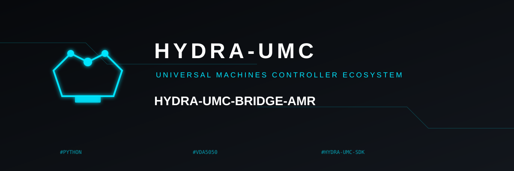
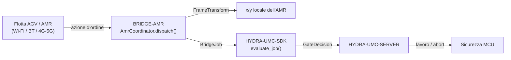

<!-- =============================================================================
HYDRA-UMC-BRIDGE-AMR - Ponte di coordinamento bidirezionale per flotte AGV/AMR
Copyright (C) 2026 JuanenRac (Electro Hobby 3D) <electrohobby3d@gmail.com>
GPL-3.0-or-later - see LICENSE
============================================================================= -->

<p align="center">
  
</p>

# 🚗 HYDRA-UMC-BRIDGE-AMR

<p align="center"><a href="README.md">🇺🇸 English</a> | <a href="README_spa.md">🇪🇸 Español</a> | <a href="README_fra.md">🇫🇷 Français</a> | 🇮🇹 <b>Italiano</b> | <a href="README_deu.md">🇩🇪 Deutsch</a> | <a href="README_zho.md">🇨🇳 简体中文</a> | <a href="README_jpn.md">🇯🇵 日本語</a></p>

### 🔗 Confine di coordinamento privo di dipendenze tra HYDRA-UMC e le flotte AGV/AMR

<p align="left">
  
  
  
</p>

---

## 1. 🛠️ PANORAMICA TECNICA

**HYDRA-UMC-BRIDGE-AMR** è il confine di coordinamento bidirezionale e di alto livello tra HYDRA-UMC e una flotta AGV/AMR (robot mobile autonomo), raggiungibile via Wi-Fi, Bluetooth o un collegamento cellulare (4G/5G). Fa esattamente due cose reali prima che un lavoro raggiunga un AMR: risolve una coordinata del sistema di riferimento di fabbrica nel sistema di riferimento locale proprio di quello specifico AMR tramite una trasformazione rigida 2D reale e verificabile a mano, e mappa una fase di lavoro su un'azione d'ordine minima ispirata a VDA 5050. Non ha alcuna logica propria di navigazione, localizzazione o evitamento ostacoli, e non può aggirare HYDRA-UMC-SERVER, i limiti dell'MCU, i watchdog o l'E-STOP.

Appartiene alla famiglia **Mobile & Autonomous Bridges** insieme a `HYDRA-UMC-BRIDGE-DROIDS` e `HYDRA-UMC-BRIDGE-UAV`, e condivide lo stesso contratto di lavoro e sicurezza `HYDRA-UMC-SDK` degli **External Automation Bridges** stazionari (CNC, LASER, OPENPNP, PRINTER3D, ROS2) - così nessun ponte, mobile o stazionario, inventa una propria definizione di "sicuro per lavorare".

### Caratteristiche principali:
* ✅ **Trasformazione reale di sistema di riferimento, verificabile a mano:** `FrameTransform` mappa una coordinata `(x, y)` del sistema di riferimento di fabbrica nel sistema di riferimento locale proprio di un AMR specifico, date l'origine e l'orientamento reali di quell'AMR sul pavimento di fabbrica - verificata con un caso identità, una traslazione pura, una rotazione di 90 gradi e un vero test di andata e ritorno. *(implementato, testato in `tests/test_coordinator.py`)*
* ✅ **Vocabolario reale di azioni d'ordine ispirato a VDA 5050:** `MOVE_TO_STAGING`, `PICK_LOAD`, `MOVE_TO_DESTINATION`, `DROP_LOAD`, `MOVE_TO_HOME`, `CANCEL_ORDER` - quest'ultimo corrisponde al nome reale dell'azione di VDA 5050 per l'annullamento di un ordine. *(implementato)*
* ✅ **Validazione reale delle coordinate per azione:** un'azione di movimento a cui mancano `x`/`y`, o che ne porta uno non numerico, viene rifiutata localmente prima che la trasformazione venga mai eseguita. *(implementato, testato)*
* ✅ **Porta di sicurezza condivisa, reale:** ogni lavoro inviato tramite `AmrCoordinator.dispatch()` viene valutato da `evaluate_job()` del `bridge_contract` di `HYDRA-UMC-SDK`, la stessa porta usata da tutti i ponti fratelli e da HYDRA-UMC-SERVER; una fase produttiva richiede una macchina esterna `IDLE` e una cella HYDRA-UMC `READY`, mentre `CANCEL_ORDER` resta richiedibile durante un guasto. *(implementato)*
* ✅ **Instradamento delle fasi chiuso ed evidenza statica:** una futura fase SDK sconosciuta viene negata. `inspect_order_plan.py` emette il piano d'ordine statico di schema `1.0` senza aprire alcun trasporto. *(implementato, testato)*
* ✅ **Build/test non mutante:** `build-test.bat`/`.sh` compilano il codice sorgente ed eseguono test unitari deterministici senza cambiare versione o CHANGELOG. *(implementato, vedi COMPILAZIONE ED ESECUZIONE più sotto)*
* 🔜 **Adattatore di trasporto reale del gestore di flotta** (un client VDA 5050 reale, o un'integrazione REST/WebSocket specifica del produttore) - introdotto solo dopo che una piattaforma di flotta reale sarà selezionata e testata. *(pianificato)*

---

## 2. 🔄 FLUSSO DI COORDINAMENTO DELL'AMR



---

## 3. 🧱 ARCHITETTURA E DECISIONI DI PROGETTAZIONE

* **Perché qui vive una trasformazione reale di sistema di riferimento, e non un semplice passaggio diretto.** Le coordinate proprie della cella HYDRA-UMC e la mappa locale di un dato AMR raramente condividono origine o orientamento - la nota di architettura incollata da cui è partito questo progetto lo segnala esplicitamente ("mappare le coordinate della mappa di fabbrica sulla mappa locale propria del robot"). `FrameTransform` è la matematica reale, verificata a mano, che colma questo divario, mantenuta come pura trigonometria senza alcuna dipendenza dal gestore di flotta, così da essere testabile ovunque.
* **Perché il vocabolario di azioni d'ordine è modellato su VDA 5050.** VDA 5050 è lo standard reale, aperto e neutrale rispetto al produttore per l'integrazione di flotte già parlato da diverse flotte AMR commerciali (e da un numero crescente di stack open source) - nominare le azioni proprie di questo repository secondo il suo vocabolario reale (`CANCEL_ORDER`, movimento con forma nodo/azione) significa che un futuro adattatore VDA 5050 reale si inserirà in modo naturale invece di richiedere uno strato di traduzione aggiunto in seguito.
* **Perché `AmrCoordinator.dispatch()` incanala comunque ogni lavoro attraverso la porta condivisa `evaluate_job()`.** Un AMR è semplicemente un altro client dello stesso `bridge_contract` usato da CNC, LASER, OPENPNP, PRINTER3D, ROS2 e DROIDS - non ottiene alcun bypass speciale della logica IDLE/READY applicata da tutti gli altri ponti e da HYDRA-UMC-SERVER.
* **Perché `CANCEL_ORDER` resta richiedibile durante un guasto.** Il requisito di fase produttiva della porta (`IDLE` + `READY`) non viene deliberatamente applicato allo stesso modo a una richiesta di abort - un operatore deve sempre poter annullare l'ordine corrente di un AMR, anche in pieno guasto.
* **Perché l'adattatore di trasporto del gestore di flotta non è ancora in questo repository.** Vincolarsi al protocollo REST/WebSocket reale di un AMR specifico (o a un client MQTT completo per VDA 5050) prima che una flotta reale sia selezionata e testata rischierebbe di incorporare ipotesi che questo nucleo locale privo di dipendenze non può verificare.
* **Come si inserisce nel resto dell'ecosistema.** BRIDGE-AMR si trova tra una flotta AMR reale e `HYDRA-UMC-SDK` → `HYDRA-UMC-SERVER` → sicurezza MCU - è un confine di coordinamento, mai un nodo di navigazione o di controllo motore, e non può aggirare HYDRA-UMC-SERVER, i limiti dell'MCU, i watchdog o l'E-STOP.

---

## 📂 STRUTTURA DELLE DIRECTORY

```text
HYDRA-UMC-BRIDGE-AMR/
├── src/
│   └── hydra_umc_bridge_amr/
│       ├── __init__.py
│       └── coordinator.py       # AmrCoordinator + FrameTransform: porta d'ordine priva di dipendenze
├── tests/
│   └── test_coordinator.py      # Test unitari deterministici, incl. geometria verificabile a mano
├── tools/
│   ├── build_test.py            # Compilatore + esecutore di test non mutante (build-test.bat/.sh)
│   ├── bump_version.py          # Sincronizza pyproject.toml, manifesto e CHANGELOG.md
│   └── inspect_order_plan.py    # Stampa il piano d'ordine statico (nessun trasporto aperto)
├── docs/
│   └── BRIDGE_GUIDE.md          # Ambito, piattaforme compatibili, script, porta di accettazione hardware
├── build-test.bat / build-test.sh  # Solo valida, non modifica mai il repository
├── build.bat / build.sh            # Valida e, solo in caso di successo, aggiorna versione + CHANGELOG
├── pyproject.toml               # Metadati del pacchetto; dipende da HYDRA-UMC-SDK (git)
├── hydra-umc.project.json       # Manifesto dell'ecosistema (versione, maturità, famiglia)
├── CHANGELOG.md
├── CODE_OF_CONDUCT.md / CONTRIBUTING.md / SECURITY.md / SUPPORT.md
├── LICENSE / LICENSE.md
└── README.md / README_*.md      # Questo file e le sue 6 traduzioni
```

---

## 4. ⚙️ COMPILAZIONE ED ESECUZIONE

Richiede Python 3.11+. `tools/build_test.py` si aspetta che `HYDRA-UMC-SDK` sia clonato come directory fratella (`../HYDRA-UMC-SDK`) o indicato tramite la variabile d'ambiente `HYDRA_UMC_SDK_ROOT`.

```bash
# Windows
build-test.bat      # solo validazione — nessun cambio di versione/CHANGELOG
build.bat            # valida e, se ha successo, aggiorna versione + CHANGELOG

# Linux/macOS
bash build-test.sh
bash build.sh
```

`build-test` compila ogni modulo sotto `src/` con `py_compile` ed esegue l'intera suite `unittest` (`tests/test_coordinator.py`) - in modo deterministico, senza connessione reale a un AMR, senza rete e senza cambio di versione/CHANGELOG. `build` esegue prima quella stessa validazione e, solo in caso di successo, chiama `tools/bump_version.py` per sincronizzare la versione tra `pyproject.toml`, `hydra-umc.project.json` e `CHANGELOG.md`. Non esiste ancora un comando `run` con hardware reale - serve un adattatore di trasporto del gestore di flotta validato e un AMR/flotta reale.

---

## ✅ Stato attuale e prossimi passi

**Reale oggi:** versione `0.0.1`, funzionale come nucleo di coordinamento privo di dipendenze (`AmrCoordinator`) con una trasformazione reale di sistema di riferimento verificata a mano (`FrameTransform`), instradamento delle fasi chiuso, uno schema d'ordine statico `plan-only`, e script build-test non mutanti collegati alla CI con un checkout dell'SDK.

**Confine di integrazione:** questo ponte è solo un confine di coordinamento - non è un nodo di navigazione né di controllo motore, e non può aggirare HYDRA-UMC-SERVER, i limiti dell'MCU, i watchdog o l'E-STOP; ogni lavoro inviato passa comunque attraverso la stessa porta condivisa usata da tutti i ponti fratelli.

**Ancora da fare:** nessun trasporto reale del gestore di flotta (VDA 5050, REST/WebSocket del produttore) né un AMR fisico è ancora stato validato - un adattatore reale sarà introdotto solo dopo che una piattaforma di flotta specifica sarà selezionata e testata.

---

## 🔗 Progetti correlati

Questo progetto fa parte di un ecosistema robotico più ampio dello stesso autore (JuanenRac / Electro Hobby 3D), che copre firmware, software di controllo, nodi IA e strumenti di flotta. Vale la pena saperlo, perché una richiesta potrebbe in realtà riguardare uno di questi progetti anziché questo repository.

### Direttamente correlati

- **[HYDRA-UMC-SDK](https://github.com/JuanenRac/HYDRA-UMC-SDK)** — il contratto condiviso di lavoro e sicurezza attraverso cui ogni ponte (incluso questo) valuta i propri lavori.
- **[HYDRA-UMC-SERVER](https://github.com/JuanenRac/HYDRA-UMC-SERVER)** — il confine autenticato dell'ecosistema a cui questo ponte riporta.
- **[HYDRA-UMC-BRIDGE-DROIDS](https://github.com/JuanenRac/HYDRA-UMC-BRIDGE-DROIDS)** — ponte mobile fratello per droidi con gambe/umanoidi.
- **[HYDRA-UMC-BRIDGE-UAV](https://github.com/JuanenRac/HYDRA-UMC-BRIDGE-UAV)** — ponte mobile fratello per droni.

### Resto dell'ecosistema

**Piattaforma HYDRA-UMC** — la micro-fabbrica multi-robot per cui questo ponte coordina gli ausiliari
- **[HYDRA-UMC](https://github.com/JuanenRac/HYDRA-UMC)** — la scheda madre CM5 + STM32H745 che orchestra fino a 8 bracci robotici.
- **[HYDRA-UMC-SERVER](https://github.com/JuanenRac/HYDRA-UMC-SERVER)** — il backend Express/WebSocket con cui parlano tutti i client di controllo e i ponti.
- **[HYDRA-UMC-STUDIO](https://github.com/JuanenRac/HYDRA-UMC-STUDIO)** — dashboard di controllo web, visualizzazione 3D multi-robot.

**External Automation Bridges** — repository fratelli che condividono questa stessa porta di lavoro `HYDRA-UMC-SDK`
- **[HYDRA-UMC-BRIDGE-CNC](https://github.com/JuanenRac/HYDRA-UMC-BRIDGE-CNC)** — ponte di coordinamento cella CNC.
- **[HYDRA-UMC-BRIDGE-LASER](https://github.com/JuanenRac/HYDRA-UMC-BRIDGE-LASER)** — ponte di coordinamento celle laser.
- **[HYDRA-UMC-BRIDGE-OPENPNP](https://github.com/JuanenRac/HYDRA-UMC-BRIDGE-OPENPNP)** — ponte di flusso schede per OpenPnP.
- **[HYDRA-UMC-BRIDGE-PRINTER3D](https://github.com/JuanenRac/HYDRA-UMC-BRIDGE-PRINTER3D)** — ponte di coordinamento per software di stampa 3D open.
- **[HYDRA-UMC-BRIDGE-ROS2](https://github.com/JuanenRac/HYDRA-UMC-BRIDGE-ROS2)** — ponte di coordinamento generico per qualsiasi piattaforma ROS 2.

**Evidenze di sicurezza e integrazione**
- **[HYDRA-UMC-SAFETY-ZONES](https://github.com/JuanenRac/HYDRA-UMC-SAFETY-ZONES)** — evidenze di sicurezza delle zone di cella usate in tutta la famiglia di ponti.
- **[HYDRA-UMC-HIL-BRIDGE](https://github.com/JuanenRac/HYDRA-UMC-HIL-BRIDGE)** — evidenze di test hardware-in-the-loop.

## 👤 AUTORE
**JuanenRac** (Electro Hobby 3D)
📧 electrohobby3d@gmail.com

## 📜 LICENZA
GPL-3.0 - Vedi LICENSE per i dettagli.
