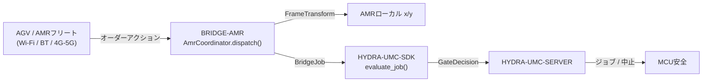

<!-- =============================================================================
HYDRA-UMC-BRIDGE-AMR - AGV/AMRフリート双方向連携ブリッジ
Copyright (C) 2026 JuanenRac (Electro Hobby 3D) <electrohobby3d@gmail.com>
GPL-3.0-or-later - see LICENSE
============================================================================= -->

<p align="center">
  
</p>

# 🚗 HYDRA-UMC-BRIDGE-AMR

<p align="center"><a href="README.md">🇺🇸 English</a> | <a href="README_spa.md">🇪🇸 Español</a> | <a href="README_fra.md">🇫🇷 Français</a> | <a href="README_ita.md">🇮🇹 Italiano</a> | <a href="README_deu.md">🇩🇪 Deutsch</a> | <a href="README_zho.md">🇨🇳 简体中文</a> | 🇯🇵 <b>日本語</b></p>

### 🔗 HYDRA-UMCとAGV/AMRフリートとの間の依存関係なし連携境界

<p align="left">
  
  
  
</p>

---

## 1. 🛠️ 技術概要

**HYDRA-UMC-BRIDGE-AMR** は、HYDRA-UMCとAGV/AMR(自律走行搬送ロボット)フリートとの間の双方向・高レベルの連携境界であり、Wi-Fi、Bluetooth、またはセルラー(4G/5G)リンク経由で到達可能である。ジョブがAMRに到達する前に、実在する2つのことだけを行う —— 工場座標系上のある座標を、実在する手計算で検証可能な2D剛体変換によって、その特定のAMR自身のローカル座標系に解決すること、そしてジョブフェーズを、VDA 5050に着想を得た最小限のオーダーアクションにマッピングすることである。独自のナビゲーション、位置推定、障害物回避のロジックは持たず、HYDRA-UMC-SERVER、MCUの限界、ウォッチドッグ、E-STOPを迂回することはできない。

`HYDRA-UMC-BRIDGE-DROIDS` および `HYDRA-UMC-BRIDGE-UAV` とともに **Mobile & Autonomous Bridges** ファミリーに属し、静的な **External Automation Bridges**(CNC、LASER、OPENPNP、PRINTER3D、ROS2)と同じ `HYDRA-UMC-SDK` のジョブ・安全契約を共有している —— つまりモバイルであれ静的であれ、いずれのブリッジも独自の「作業に安全」という定義を勝手に作ることはない。

### 主な機能:
* ✅ **実在する手計算で検証可能な座標系変換:** `FrameTransform` は、工場座標系の `(x, y)` を、そのAMR自身の実在する原点・方位を用いて特定のAMR自身のローカル座標系にマッピングする —— 単位変換ケース、純粋な並進、90度の方位回転、実在する往復テストによって検証済みである。*(実装済み、`tests/test_coordinator.py` でテスト済み)*
* ✅ **実在するVDA 5050に着想を得たオーダーアクション語彙:** `MOVE_TO_STAGING`、`PICK_LOAD`、`MOVE_TO_DESTINATION`、`DROP_LOAD`、`MOVE_TO_HOME`、`CANCEL_ORDER` —— 最後の1つはオーダーキャンセルに対するVDA 5050自身の実在するアクション名と一致する。*(実装済み)*
* ✅ **実在するアクションごとの座標検証:** `x`/`y` が欠けている、あるいは数値でない値を持つ移動アクションは、変換が実行される前にローカルで拒否される。*(実装済み、テスト済み)*
* ✅ **実在する共有安全ゲート:** `AmrCoordinator.dispatch()` を通じて送信されるすべてのジョブは、`HYDRA-UMC-SDK` の `bridge_contract` にある `evaluate_job()` によって評価される。これは他のすべての兄弟ブリッジとHYDRA-UMC-SERVERが使うのと同じゲートである。生産フェーズには外部機械が `IDLE` であり、HYDRA-UMCセルが `READY` であることが必要だが、`CANCEL_ORDER` は故障中でも要求可能なままである。*(実装済み)*
* ✅ **フェイルクローズのフェーズルーティングと静的エビデンス:** 未知の将来SDKフェーズは拒否される。`inspect_order_plan.py` はトランスポートを一切開かずに静的スキーマ `1.0` のオーダープランを出力する。*(実装・テスト済み)*
* ✅ **非破壊的なビルド/テスト:** `build-test.bat`/`.sh` はソースをコンパイルし、バージョンやCHANGELOGを変更せずに決定論的なユニットテストを実行する。*(実装済み、下記「ビルドと実行」を参照)*
* 🔜 **実際のフリートマネージャー・トランスポートアダプター**(実在するVDA 5050クライアント、またはベンダー固有のREST/WebSocket連携) —— 実際のフリートプラットフォームが選定・テストされた後にのみ導入される。*(計画中)*

---

## 2. 🔄 AMR連携フロー



---

## 3. 🧱 アーキテクチャと設計判断

* **なぜ単なるパススルーではなく、実在する座標系変換がここに存在するのか。** HYDRA-UMC自身のセル座標と、特定のAMRのローカルマップとは、原点や方位を共有していることはめったにない —— 本プロジェクトが出発点とした貼り付けられたアーキテクチャノートはこれを明示的に指摘している(「工場マップの座標をロボット自身のローカルマップにマッピングする」)。`FrameTransform` は、そのギャップを埋める実在する手検証済みの数学であり、フリートマネージャーへの依存を持たない純粋な三角関数として保たれているため、どこでもテスト可能である。
* **なぜオーダーアクション語彙はVDA 5050に沿って形作られているのか。** VDA 5050は、複数の商用AMRフリート(および増加しつつあるオープンソーススタック)がすでに話している、実在するオープンでベンダー中立なフリート連携標準である —— 本リポジトリ自身のアクションをその実在する語彙(`CANCEL_ORDER`、ノード/アクション形式の移動)にちなんで命名することで、将来の実在するVDA 5050アダプターは、後から取り付けられた変換レイヤーではなく、自然な適合となる。
* **なぜ `AmrCoordinator.dispatch()` はそれでも共有の `evaluate_job()` ゲートを通してすべてのジョブを流すのか。** AMRは、CNC、LASER、OPENPNP、PRINTER3D、ROS2、DROIDSが使うのと同じ `bridge_contract` の単なる別のクライアントに過ぎない —— 他のすべてのブリッジやHYDRA-UMC-SERVERが強制するIDLE/READYロジックを特別に迂回することはない。
* **なぜ `CANCEL_ORDER` は故障中でも要求可能なままなのか。** ゲートの生産フェーズ要件(`IDLE` + `READY`)は、中止リクエストには意図的に同じ方法で適用されない —— オペレーターは、故障の最中であっても、AMRの現在のオーダーを常にキャンセルできなければならない。
* **なぜフリートマネージャー・トランスポートアダプターがまだこのリポジトリにないのか。** 特定のAMRの実際のREST/WebSocketプロトコル(あるいは完全なVDA 5050 MQTTクライアント)に、実際のフリートが選定・テストされる前にコミットすることは、この依存関係のないローカルコアが検証できない前提を組み込むリスクを伴う。
* **エコシステムの他部分とどう関係するか。** BRIDGE-AMRは実際のAMRフリートと `HYDRA-UMC-SDK` → `HYDRA-UMC-SERVER` → MCU安全との間に位置する —— 連携境界であり、ナビゲーションノードでもモーター制御ノードでも決してなく、HYDRA-UMC-SERVER、MCUの限界、ウォッチドッグ、E-STOPを迂回することはできない。

---

## 📂 ディレクトリ構成

```text
HYDRA-UMC-BRIDGE-AMR/
├── src/
│   └── hydra_umc_bridge_amr/
│       ├── __init__.py
│       └── coordinator.py       # AmrCoordinator + FrameTransform: 依存関係なしのオーダーゲート
├── tests/
│   └── test_coordinator.py      # 決定論的ユニットテスト(手計算で検証可能な幾何学を含む)
├── tools/
│   ├── build_test.py            # 非破壊的なコンパイル+テストランナー (build-test.bat/.sh)
│   ├── bump_version.py          # pyproject.toml、マニフェスト、CHANGELOG.md を同期
│   └── inspect_order_plan.py    # 静的なオーダープランを出力する(トランスポートを開かない)
├── docs/
│   └── BRIDGE_GUIDE.md          # 適用範囲、対応プラットフォーム、スクリプト、ハードウェア受け入れゲート
├── build-test.bat / build-test.sh  # 検証のみ、リポジトリを一切変更しない
├── build.bat / build.sh            # 検証後、成功時のみバージョン + CHANGELOG を更新
├── pyproject.toml               # パッケージメタデータ。HYDRA-UMC-SDK に依存 (git)
├── hydra-umc.project.json       # エコシステムマニフェスト(バージョン、成熟度、ファミリー)
├── CHANGELOG.md
├── CODE_OF_CONDUCT.md / CONTRIBUTING.md / SECURITY.md / SUPPORT.md
├── LICENSE / LICENSE.md
└── README.md / README_*.md      # 本ファイルおよびその6言語訳
```

---

## 4. ⚙️ ビルドと実行

Python 3.11以上が必要。`tools/build_test.py` は `HYDRA-UMC-SDK` が兄弟ディレクトリ(`../HYDRA-UMC-SDK`)としてチェックアウトされているか、環境変数 `HYDRA_UMC_SDK_ROOT` で指定されていることを期待する。

```bash
# Windows
build-test.bat      # 検証のみ —— バージョン/CHANGELOGの変更なし
build.bat            # 検証後、成功時にバージョン + CHANGELOG を更新

# Linux/macOS
bash build-test.sh
bash build.sh
```

`build-test` は `src/` 配下の各モジュールを `py_compile` でコンパイルし、`unittest` の全スイート(`tests/test_coordinator.py`)を実行する —— 実際のAMR接続もネットワークもなく決定論的に動作し、バージョンやCHANGELOGを変更しない。`build` はまず同じ検証を実行し、成功した場合のみ `tools/bump_version.py` を呼び出して `pyproject.toml`、`hydra-umc.project.json`、`CHANGELOG.md` の間でバージョンを同期する。実際のハードウェア向け `run` コマンドはまだ存在しない —— それには検証済みのフリートマネージャー・トランスポートアダプターと実際のAMR/フリートが必要である。

---

## ✅ 現状と次のステップ

**現時点で実在するもの:** バージョン `0.0.1`。実在する手検証済みの座標系変換(`FrameTransform`)、フェイルクローズのフェーズルーティング、静的な `plan-only` オーダースキーマ、SDKチェックアウトを伴いCIに組み込まれた非破壊的なbuild-testスクリプトを備える依存関係なしの連携コア(`AmrCoordinator`)として機能している。

**統合境界:** このブリッジは連携境界に過ぎない —— ナビゲーションノードでもモーター制御ノードでもなく、HYDRA-UMC-SERVER、MCUの限界、ウォッチドッグ、E-STOPを迂回することはできない。送信されるすべてのジョブは、依然としてすべての兄弟ブリッジが使う同じ共有ゲートを通過する。

**今後の課題:** 実際のフリートマネージャー・トランスポート(VDA 5050、ベンダーREST/WebSocket)も物理的なAMRもまだ一切検証されていない —— 実際のアダプターは、具体的なフリートプラットフォームが選定・テストされた後にのみ導入される。

---

## 🔗 関連プロジェクト

本プロジェクトは、同じ著者(JuanenRac / Electro Hobby 3D)によるより大きなロボティクス・エコシステムの一部であり、ファームウェア、制御ソフトウェア、AIノード、フリート管理ツールにまたがる。

### 直接関連

- **[HYDRA-UMC-SDK](https://github.com/JuanenRac/HYDRA-UMC-SDK)** —— このブリッジ(および他のすべてのブリッジ)がジョブを評価する共有のジョブ・安全契約。
- **[HYDRA-UMC-SERVER](https://github.com/JuanenRac/HYDRA-UMC-SERVER)** —— このブリッジが報告する認証済みエコシステム境界。
- **[HYDRA-UMC-BRIDGE-DROIDS](https://github.com/JuanenRac/HYDRA-UMC-BRIDGE-DROIDS)** —— レッグ型・ヒューマノイド型ドロイド向けの兄弟モバイルブリッジ。
- **[HYDRA-UMC-BRIDGE-UAV](https://github.com/JuanenRac/HYDRA-UMC-BRIDGE-UAV)** —— ドローン向けの兄弟モバイルブリッジ。

### エコシステムのその他

**HYDRA-UMCプラットフォーム** —— このブリッジが補助機能を調整するマルチロボット・マイクロファクトリー
- **[HYDRA-UMC](https://github.com/JuanenRac/HYDRA-UMC)** —— 最大8本のロボットアームを統括するCM5 + STM32H745マザーボード。
- **[HYDRA-UMC-SERVER](https://github.com/JuanenRac/HYDRA-UMC-SERVER)** —— すべての制御クライアントとブリッジが通信するExpress/WebSocketバックエンド。
- **[HYDRA-UMC-STUDIO](https://github.com/JuanenRac/HYDRA-UMC-STUDIO)** —— Webベースの制御ダッシュボード、マルチロボット3D可視化。

**External Automation Bridges** —— 同じ `HYDRA-UMC-SDK` ジョブゲートを共有する兄弟リポジトリ群
- **[HYDRA-UMC-BRIDGE-CNC](https://github.com/JuanenRac/HYDRA-UMC-BRIDGE-CNC)** —— CNCセル連携ブリッジ。
- **[HYDRA-UMC-BRIDGE-LASER](https://github.com/JuanenRac/HYDRA-UMC-BRIDGE-LASER)** —— レーザーセル連携ブリッジ。
- **[HYDRA-UMC-BRIDGE-OPENPNP](https://github.com/JuanenRac/HYDRA-UMC-BRIDGE-OPENPNP)** —— OpenPnP向けボードフローブリッジ。
- **[HYDRA-UMC-BRIDGE-PRINTER3D](https://github.com/JuanenRac/HYDRA-UMC-BRIDGE-PRINTER3D)** —— オープンな3Dプリントソフトウェア向け連携ブリッジ。
- **[HYDRA-UMC-BRIDGE-ROS2](https://github.com/JuanenRac/HYDRA-UMC-BRIDGE-ROS2)** —— 任意のROS 2プラットフォーム向け汎用連携ブリッジ。

**安全・統合の実証**
- **[HYDRA-UMC-SAFETY-ZONES](https://github.com/JuanenRac/HYDRA-UMC-SAFETY-ZONES)** —— ブリッジファミリー全体で使われるセルゾーンの安全実証。
- **[HYDRA-UMC-HIL-BRIDGE](https://github.com/JuanenRac/HYDRA-UMC-HIL-BRIDGE)** —— ハードウェア・イン・ザ・ループのテスト実証。

## 👤 作者
**JuanenRac** (Electro Hobby 3D)
📧 electrohobby3d@gmail.com
📺 [youtube.com/@electrohobby3d](https://youtube.com/@electrohobby3d)

## 📜 ライセンス
GPL-3.0 - 詳細はLICENSEを参照。
