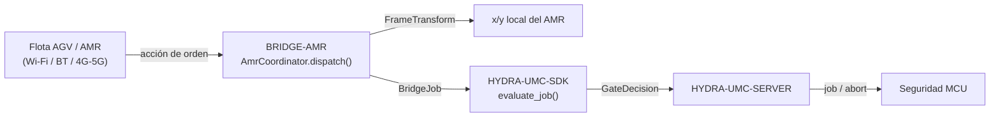

<!-- =============================================================================
HYDRA-UMC-BRIDGE-AMR - Puente de coordinación bidireccional para flotas AGV/AMR
Copyright (C) 2026 JuanenRac (Electro Hobby 3D) <electrohobby3d@gmail.com>
GPL-3.0-or-later - see LICENSE
============================================================================= -->

<p align="center">
  
</p>

# 🚗 HYDRA-UMC-BRIDGE-AMR

<p align="center"><a href="README.md">🇺🇸 English</a> | 🇪🇸 <b>Español</b> | <a href="README_fra.md">🇫🇷 Français</a> | <a href="README_ita.md">🇮🇹 Italiano</a> | <a href="README_deu.md">🇩🇪 Deutsch</a> | <a href="README_zho.md">🇨🇳 简体中文</a> | <a href="README_jpn.md">🇯🇵 日本語</a></p>

### 🔗 Frontera de coordinación sin dependencias entre HYDRA-UMC y flotas AGV/AMR

<p align="left">
  
  
  
</p>

---

## 1. 🛠️ VISIÓN TÉCNICA GENERAL

**HYDRA-UMC-BRIDGE-AMR** es la frontera de coordinación bidireccional de alto nivel entre HYDRA-UMC y una flota AGV/AMR (robot móvil autónomo), accesible por Wi-Fi, Bluetooth o un enlace celular (4G/5G). Hace exactamente dos cosas reales antes de que un trabajo llegue a un AMR: resuelve una coordenada del marco de fábrica al marco local propio de ese AMR mediante una transformación rígida 2D real y comprobable a mano, y mapea una fase de trabajo a una acción de orden mínima inspirada en VDA 5050. No tiene lógica propia de navegación, localización ni evasión de obstáculos, y no puede saltarse a HYDRA-UMC-SERVER, los límites del MCU, los watchdogs ni el E-STOP.

Pertenece a la familia **Mobile & Autonomous Bridges** junto a `HYDRA-UMC-BRIDGE-DROIDS` y `HYDRA-UMC-BRIDGE-UAV`, y comparte el mismo contrato de trabajo y seguridad de `HYDRA-UMC-SDK` que los **External Automation Bridges** estacionarios (CNC, LASER, OPENPNP, PRINTER3D, ROS2).

### Características clave:
* ✅ **Transformación real de marco de coordenadas, comprobable a mano:** `FrameTransform` mapea una coordenada `(x, y)` del marco de fábrica al marco local propio de un AMR concreto, dados su origen y su rumbo reales en la planta - verificada con un caso identidad, una traslación pura, una rotación de 90 grados y un test real de ida y vuelta. *(implementado, probado en `tests/test_coordinator.py`)*
* ✅ **Vocabulario real de acciones de orden inspirado en VDA 5050:** `MOVE_TO_STAGING`, `PICK_LOAD`, `MOVE_TO_DESTINATION`, `DROP_LOAD`, `MOVE_TO_HOME`, `CANCEL_ORDER` - este último coincide con el nombre real de la acción de VDA 5050 para cancelar una orden. *(implementado)*
* ✅ **Validación real de coordenadas por acción:** una acción de movimiento a la que le falten `x`/`y`, o con un valor no numérico, se rechaza localmente antes de que se ejecute la transformación. *(implementado, probado)*
* ✅ **Puerta de seguridad compartida real:** cada trabajo despachado mediante `AmrCoordinator.dispatch()` se evalúa con `evaluate_job()` de `bridge_contract` de `HYDRA-UMC-SDK`, la misma puerta que usan todos los bridges hermanos y HYDRA-UMC-SERVER; una fase productiva exige una máquina externa `IDLE` y una celda HYDRA-UMC `READY`, mientras que `CANCEL_ORDER` sigue siendo solicitable durante un fallo. *(implementado)*
* ✅ **Enrutado de fase con fallo cerrado y evidencia estática:** una fase futura del SDK desconocida se rechaza. `inspect_order_plan.py` emite el plan de orden estático del esquema `1.0` sin abrir ningún transporte. *(implementado, probado)*
* ✅ **Build/test sin mutación:** `build-test.bat`/`.sh` compilan el código fuente y ejecutan tests deterministas sin cambiar versión ni CHANGELOG. *(implementado, ver BUILD Y EJECUCIÓN más abajo)*
* 🔜 **Adaptador de transporte real de gestor de flota** (un cliente VDA 5050 real, o una integración REST/WebSocket de fabricante) - se introducirá solo tras seleccionar y probar una plataforma de flota real. *(planeado)*

---

## 2. 🔄 FLUJO DE COORDINACIÓN DEL AMR



---

## 3. 🧱 ARQUITECTURA Y DECISIONES DE DISEÑO

* **Por qué vive aquí una transformación real de marco de coordenadas, y no solo un paso directo.** Las coordenadas propias de la celda HYDRA-UMC y el mapa local de un AMR concreto casi nunca comparten origen ni rumbo - la nota de arquitectura pegada de la que partió este proyecto lo señala explícitamente ("mapear coordenadas del mapa de fábrica al mapa local del robot"). `FrameTransform` es la matemática real y verificada a mano que cierra esa brecha, mantenida como trigonometría pura sin dependencia de ningún gestor de flota, para que se pueda probar en cualquier sitio.
* **Por qué el vocabulario de acciones de orden está moldeado según VDA 5050.** VDA 5050 es el estándar real, abierto y neutral de fabricante para integración de flotas que ya hablan varias flotas AMR comerciales (y un número creciente de stacks de código abierto) - nombrar las acciones propias de este repo según su vocabulario real (`CANCEL_ORDER`, movimiento con forma de nodo/acción) significa que un futuro adaptador VDA 5050 real encaja de forma natural en vez de necesitar una capa de traducción añadida después.
* **Por qué `AmrCoordinator.dispatch()` sigue canalizando cada trabajo por la puerta compartida `evaluate_job()`.** Un AMR es solo otro cliente del mismo `bridge_contract` que usan CNC, LASER, OPENPNP, PRINTER3D, ROS2 y DROIDS - no tiene ningún salto especial de la lógica IDLE/READY que hacen cumplir todos los demás bridges y HYDRA-UMC-SERVER.
* **Por qué `CANCEL_ORDER` sigue siendo solicitable durante un fallo.** El requisito de fase productiva de la puerta (`IDLE` + `READY`) deliberadamente no se aplica igual a una petición de aborto - un operador siempre debe poder cancelar la orden actual de un AMR, incluso en mitad de un fallo.
* **Por qué el adaptador de transporte del gestor de flota aún no está en este repositorio.** Comprometerse con el protocolo REST/WebSocket real de un AMR concreto (o un cliente MQTT completo de VDA 5050) antes de seleccionar y probar una flota real arriesgaría a dar por sentadas suposiciones que este núcleo local y sin dependencias no puede verificar.
* **Cómo encaja esto en el resto del ecosistema.** BRIDGE-AMR se sitúa entre una flota AMR real y `HYDRA-UMC-SDK` → `HYDRA-UMC-SERVER` → seguridad MCU - es una frontera de coordinación, nunca un nodo de navegación o control de motores, y no puede saltarse HYDRA-UMC-SERVER, los límites del MCU, los watchdogs ni el E-STOP.

---

## 📂 ESTRUCTURA DE DIRECTORIOS

```text
HYDRA-UMC-BRIDGE-AMR/
├── src/
│   └── hydra_umc_bridge_amr/
│       ├── __init__.py
│       └── coordinator.py       # AmrCoordinator + FrameTransform: puerta de orden sin dependencias
├── tests/
│   └── test_coordinator.py      # Tests unitarios deterministas, incl. geometría comprobable a mano
├── tools/
│   ├── build_test.py            # Compilación + tests sin mutación (build-test.bat/.sh)
│   ├── bump_version.py          # Sincroniza pyproject.toml, manifiesto y CHANGELOG.md
│   └── inspect_order_plan.py    # Imprime el plan de orden estático (sin abrir transporte)
├── docs/
│   └── BRIDGE_GUIDE.md          # Alcance, plataformas compatibles, scripts, puerta de aceptación de hardware
├── build-test.bat / build-test.sh  # Solo valida, nunca modifica el repositorio
├── build.bat / build.sh            # Valida y luego sube versión + CHANGELOG si tiene éxito
├── pyproject.toml               # Metadatos del paquete; depende de HYDRA-UMC-SDK (git)
├── hydra-umc.project.json       # Manifiesto del ecosistema (versión, madurez, familia)
├── CHANGELOG.md
├── CODE_OF_CONDUCT.md / CONTRIBUTING.md / SECURITY.md / SUPPORT.md
├── LICENSE / LICENSE.md
└── README.md / README_*.md      # Este archivo y sus 6 traducciones
```

---

## 4. ⚙️ BUILD Y EJECUCIÓN

Requiere Python 3.11+. `tools/build_test.py` espera `HYDRA-UMC-SDK` clonado como directorio hermano (`../HYDRA-UMC-SDK`) o indicado mediante la variable de entorno `HYDRA_UMC_SDK_ROOT`.

```bash
# Windows
build-test.bat      # solo valida — sin cambio de versión/CHANGELOG
build.bat            # valida y luego sube versión + CHANGELOG si tiene éxito

# Linux/macOS
bash build-test.sh
bash build.sh
```

`build-test` compila cada módulo bajo `src/` con `py_compile` y ejecuta la suite completa de `unittest` (`tests/test_coordinator.py`) - de forma determinista, sin conexión real a ningún AMR, sin red y sin cambio de versión/CHANGELOG. `build` ejecuta esa misma validación primero y, solo si tiene éxito, llama a `tools/bump_version.py` para sincronizar la versión entre `pyproject.toml`, `hydra-umc.project.json` y `CHANGELOG.md`. Todavía no existe un comando `run` con hardware real - eso requiere un adaptador de transporte de gestor de flota validado y una flota AMR real.

---

## ✅ Estado actual y próximos pasos

**Real hoy:** versión `0.0.1`, funcional como núcleo de coordinación sin dependencias (`AmrCoordinator`) con una transformación real de marco de coordenadas verificada a mano (`FrameTransform`), enrutado de fase con fallo cerrado, un esquema de orden estático `plan-only`, y scripts de build-test sin mutación integrados en CI con un checkout del SDK.

**Frontera de integración:** este bridge es solo una frontera de coordinación - no es un nodo de navegación ni de control de motores, y no puede saltarse HYDRA-UMC-SERVER, los límites del MCU, los watchdogs ni el E-STOP; cada trabajo despachado sigue pasando por la misma puerta compartida que usan todos los bridges hermanos.

**Todavía pendiente:** aún no se ha validado ningún transporte real de gestor de flota (VDA 5050, REST/WebSocket de fabricante) ni un AMR físico - un adaptador real se introducirá solo después de seleccionar y probar una plataforma de flota concreta.

---

## 🔗 Proyectos relacionados

Este proyecto forma parte de un ecosistema de robótica más amplio del mismo autor (JuanenRac / Electro Hobby 3D), que abarca firmware, software de control, nodos de IA y herramientas de flota.

### Directamente relacionados

- **[HYDRA-UMC-SDK](https://github.com/JuanenRac/HYDRA-UMC-SDK)** — el contrato compartido de trabajo y seguridad por el que pasa cada bridge (incluido este).
- **[HYDRA-UMC-SERVER](https://github.com/JuanenRac/HYDRA-UMC-SERVER)** — la frontera autenticada del ecosistema a la que reporta este bridge.
- **[HYDRA-UMC-BRIDGE-DROIDS](https://github.com/JuanenRac/HYDRA-UMC-BRIDGE-DROIDS)** — bridge móvil hermano para droides con patas/humanoides.
- **[HYDRA-UMC-BRIDGE-UAV](https://github.com/JuanenRac/HYDRA-UMC-BRIDGE-UAV)** — bridge móvil hermano para drones.

### Resto del ecosistema

**Plataforma HYDRA-UMC** — la microfábrica multi-robot para la que este bridge coordina auxiliares
- **[HYDRA-UMC](https://github.com/JuanenRac/HYDRA-UMC)** — la placa base CM5 + STM32H745 que orquesta hasta 8 brazos robóticos.
- **[HYDRA-UMC-SERVER](https://github.com/JuanenRac/HYDRA-UMC-SERVER)** — el backend Express/WebSocket con el que habla cada cliente de control y cada bridge.
- **[HYDRA-UMC-STUDIO](https://github.com/JuanenRac/HYDRA-UMC-STUDIO)** — panel de control web, visualización 3D multi-robot.

**External Automation Bridges** — repos hermanos que comparten la misma puerta `HYDRA-UMC-SDK`
- **[HYDRA-UMC-BRIDGE-CNC](https://github.com/JuanenRac/HYDRA-UMC-BRIDGE-CNC)** — bridge de coordinación de celda CNC.
- **[HYDRA-UMC-BRIDGE-LASER](https://github.com/JuanenRac/HYDRA-UMC-BRIDGE-LASER)** — bridge de coordinación de celda láser.
- **[HYDRA-UMC-BRIDGE-OPENPNP](https://github.com/JuanenRac/HYDRA-UMC-BRIDGE-OPENPNP)** — bridge de flujo de placas para OpenPnP.
- **[HYDRA-UMC-BRIDGE-PRINTER3D](https://github.com/JuanenRac/HYDRA-UMC-BRIDGE-PRINTER3D)** — bridge de coordinación para software de impresión 3D abierto.
- **[HYDRA-UMC-BRIDGE-ROS2](https://github.com/JuanenRac/HYDRA-UMC-BRIDGE-ROS2)** — bridge de coordinación genérico para cualquier plataforma ROS 2.

**Evidencia de seguridad e integración**
- **[HYDRA-UMC-SAFETY-ZONES](https://github.com/JuanenRac/HYDRA-UMC-SAFETY-ZONES)** — evidencia de seguridad por zonas de celda usada en toda la familia de bridges.
- **[HYDRA-UMC-HIL-BRIDGE](https://github.com/JuanenRac/HYDRA-UMC-HIL-BRIDGE)** — evidencia de pruebas hardware-in-the-loop.

## 👤 AUTOR
**JuanenRac** (Electro Hobby 3D)
📧 electrohobby3d@gmail.com

## 📜 LICENCIA
GPL-3.0 - Ver LICENSE para más detalles.
