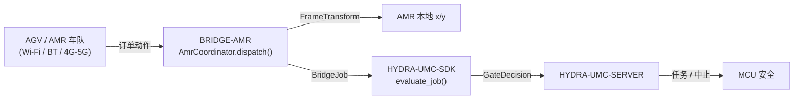

<!-- =============================================================================
HYDRA-UMC-BRIDGE-AMR - AGV/AMR 车队双向协调桥接
Copyright (C) 2026 JuanenRac (Electro Hobby 3D) <electrohobby3d@gmail.com>
GPL-3.0-or-later - see LICENSE
============================================================================= -->

<p align="center">
  
</p>

# 🚗 HYDRA-UMC-BRIDGE-AMR

<p align="center"><a href="README.md">🇺🇸 English</a> | <a href="README_spa.md">🇪🇸 Español</a> | <a href="README_fra.md">🇫🇷 Français</a> | <a href="README_ita.md">🇮🇹 Italiano</a> | <a href="README_deu.md">🇩🇪 Deutsch</a> | 🇨🇳 <b>简体中文</b> | <a href="README_jpn.md">🇯🇵 日本語</a></p>

### 🔗 HYDRA-UMC 与 AGV/AMR 车队之间无依赖的协调边界

<p align="left">
  
  
  
</p>

---

## 1. 🛠️ 技术概览

**HYDRA-UMC-BRIDGE-AMR** 是 HYDRA-UMC 与 AGV/AMR(自主移动机器人)车队之间双向的高层协调边界,可通过 Wi-Fi、蓝牙或蜂窝(4G/5G)链路访问。在任务到达某台 AMR 之前,它只做两件真实的事情:通过一个真实的、可手工核验的 2D 刚体变换,把工厂坐标系中的坐标解算到那台具体 AMR 自身的本地坐标系中;并把一个任务阶段映射为一个最小化的、受 VDA-5050 启发的订单动作。它没有任何自己的导航、定位或避障逻辑,也不能绕过 HYDRA-UMC-SERVER、MCU 限位、看门狗或急停(E-STOP)。

它与 `HYDRA-UMC-BRIDGE-DROIDS` 和 `HYDRA-UMC-BRIDGE-UAV` 同属 **Mobile & Autonomous Bridges** 家族,并与固定式的 **External Automation Bridges**(CNC、LASER、OPENPNP、PRINTER3D、ROS2)共享同一个 `HYDRA-UMC-SDK` 任务与安全契约——因此无论是移动式还是固定式,任何一个桥接都不能自行发明"可以安全工作"的定义。

### 核心特性:
* ✅ **真实的、可手工核验的坐标系变换:** `FrameTransform` 根据某台 AMR 在工厂地面上真实的原点/朝向,把工厂坐标系中的 `(x, y)` 映射到该 AMR 自身的本地坐标系——通过一个恒等情形、一个纯平移、一个 90 度朝向旋转以及一个真实的往返测试进行了验证。*(已实现,并在 `tests/test_coordinator.py` 中测试)*
* ✅ **真实的、受 VDA-5050 启发的订单动作词汇:** `MOVE_TO_STAGING`、`PICK_LOAD`、`MOVE_TO_DESTINATION`、`DROP_LOAD`、`MOVE_TO_HOME`、`CANCEL_ORDER`——最后一个与 VDA 5050 自身用于取消订单的真实动作名称一致。*(已实现)*
* ✅ **真实的按动作坐标校验:** 缺少 `x`/`y`,或携带非数值坐标的移动动作,会在变换运行之前就在本地被拒绝。*(已实现,已测试)*
* ✅ **真实的共享安全门控:** 每个通过 `AmrCoordinator.dispatch()` 派发的任务都会由 `HYDRA-UMC-SDK` 的 `bridge_contract` 中的 `evaluate_job()` 评估,这与所有兄弟桥接以及 HYDRA-UMC-SERVER 使用的是同一个门控;生产性阶段需要外部机器处于 `IDLE` 且 HYDRA-UMC 单元处于 `READY`,而 `CANCEL_ORDER` 在故障期间仍可请求。*(已实现)*
* ✅ **安全拒绝的阶段路由与静态证据:** 未知的未来 SDK 阶段会被拒绝。`inspect_order_plan.py` 会输出静态模式 `1.0` 的订单计划,且不会打开任何传输通道。*(已实现,已测试)*
* ✅ **非变更式构建/测试:** `build-test.bat`/`.sh` 编译源码并运行确定性单元测试,不改变版本或 CHANGELOG。*(已实现,见下方"构建与运行")*
* 🔜 **真实的车队管理器传输适配器**(一个真实的 VDA 5050 客户端,或某个厂商专属的 REST/WebSocket 集成)——只有在选定并测试了真实的车队平台之后才会引入。*(计划中)*

---

## 2. 🔄 AMR 协调流程



---

## 3. 🧱 架构与设计决策

* **为什么这里存在一个真实的坐标系变换,而不仅仅是直接透传。** HYDRA-UMC 自身单元的坐标与任意一台 AMR 的本地地图很少共享同一个原点或朝向——本项目起步时所依据的架构笔记明确指出了这一点("把工厂地图坐标映射到机器人自身的本地地图")。`FrameTransform` 就是弥合这一差距的真实的、经过手工验证的数学计算,它被保持为纯粹的三角函数运算,不依赖任何车队管理器,因此可以在任何地方测试。
* **为什么订单动作词汇围绕 VDA 5050 设计。** VDA 5050 是一个真实的、开放的、厂商中立的车队集成标准,已经有多个商用 AMR 车队(以及数量不断增长的开源技术栈)在使用它——按照它真实的词汇为本仓库自己的动作命名(`CANCEL_ORDER`、节点/动作形态的移动),意味着未来一个真实的 VDA 5050 适配器可以自然地契合进来,而不需要事后再补一层转换层。
* **为什么 `AmrCoordinator.dispatch()` 仍然让每个任务都经过共享的 `evaluate_job()` 门控。** AMR 只是使用与 CNC、LASER、OPENPNP、PRINTER3D、ROS2 和 DROIDS 相同的 `bridge_contract` 的又一个客户端——它不会获得任何绕过所有其他桥接和 HYDRA-UMC-SERVER 所执行的 IDLE/READY 逻辑的特殊待遇。
* **为什么 `CANCEL_ORDER` 在故障期间仍可请求。** 门控的生产性阶段要求(`IDLE` + `READY`)被刻意地不以同样的方式应用于中止请求——操作员必须始终能够取消一台 AMR 当前的订单,即使正处于故障中。
* **为什么车队管理器传输适配器尚未加入本仓库。** 在选定并测试真实车队之前就对某台 AMR 真实的 REST/WebSocket 协议(或一个完整的 VDA 5050 MQTT 客户端)做出承诺,会有引入这个本地无依赖核心无法验证的假设的风险。
* **它如何融入整个生态系统。** BRIDGE-AMR 位于真实的 AMR 车队与 `HYDRA-UMC-SDK` → `HYDRA-UMC-SERVER` → MCU 安全之间——它是一个协调边界,绝不是导航或电机控制节点,也不能绕过 HYDRA-UMC-SERVER、MCU 限位、看门狗或急停。

---

## 📂 目录结构

```text
HYDRA-UMC-BRIDGE-AMR/
├── src/
│   └── hydra_umc_bridge_amr/
│       ├── __init__.py
│       └── coordinator.py       # AmrCoordinator + FrameTransform:无依赖的订单门控
├── tests/
│   └── test_coordinator.py      # 确定性单元测试,含可手工核验的几何计算
├── tools/
│   ├── build_test.py            # 非变更式编译 + 测试运行器 (build-test.bat/.sh)
│   ├── bump_version.py          # 同步 pyproject.toml、清单和 CHANGELOG.md
│   └── inspect_order_plan.py    # 打印静态订单计划(不打开传输通道)
├── docs/
│   └── BRIDGE_GUIDE.md          # 范围、兼容平台、脚本、硬件验收门控
├── build-test.bat / build-test.sh  # 仅验证,绝不修改仓库
├── build.bat / build.sh            # 先验证,成功后才更新版本 + CHANGELOG
├── pyproject.toml               # 包元数据;依赖 HYDRA-UMC-SDK (git)
├── hydra-umc.project.json       # 生态系统清单(版本、成熟度、家族)
├── CHANGELOG.md
├── CODE_OF_CONDUCT.md / CONTRIBUTING.md / SECURITY.md / SUPPORT.md
├── LICENSE / LICENSE.md
└── README.md / README_*.md      # 本文件及其 6 种译文
```

---

## 4. ⚙️ 构建与运行

需要 Python 3.11+。`tools/build_test.py` 期望 `HYDRA-UMC-SDK` 作为兄弟目录被检出(`../HYDRA-UMC-SDK`),或通过环境变量 `HYDRA_UMC_SDK_ROOT` 指定。

```bash
# Windows
build-test.bat      # 仅验证 —— 不改变版本/CHANGELOG
build.bat            # 先验证,成功后更新版本 + CHANGELOG

# Linux/macOS
bash build-test.sh
bash build.sh
```

`build-test` 使用 `py_compile` 编译 `src/` 下的每个模块,并运行完整的 `unittest` 套件(`tests/test_coordinator.py`)——以确定性的方式进行,没有真实 AMR 连接,没有网络,也不会改变版本/CHANGELOG。`build` 会先运行同样的验证,只有成功后才调用 `tools/bump_version.py`,在 `pyproject.toml`、`hydra-umc.project.json` 和 `CHANGELOG.md` 之间同步版本号。目前尚无真正的硬件 `run` 命令——这需要经过验证的车队管理器传输适配器和真实的 AMR/车队。

---

## ✅ 当前状态与后续步骤

**目前真实的部分:** 版本 `0.0.1`,作为一个无依赖协调核心(`AmrCoordinator`)是功能齐备的,配有真实的、经过手工验证的坐标系变换(`FrameTransform`)、安全拒绝的阶段路由、静态 `plan-only` 订单模式,以及已接入 CI 并带 SDK 检出的非变更式 build-test 脚本。

**集成边界:** 本桥接只是一个协调边界——它不是导航或电机控制节点,也不能绕过 HYDRA-UMC-SERVER、MCU 限位、看门狗或急停;每个被派发的任务仍然要经过所有兄弟桥接使用的同一个共享门控。

**仍待完成:** 尚未验证任何真实的车队管理器传输方式(VDA 5050、厂商 REST/WebSocket)或物理 AMR——真实的适配器只会在选定并测试了具体的车队平台之后才会引入。

---

## 🔗 相关项目

本项目是同一作者(JuanenRac / Electro Hobby 3D)更大的机器人生态系统的一部分,涵盖固件、控制软件、AI 节点和车队工具。

### 直接相关

- **[HYDRA-UMC-SDK](https://github.com/JuanenRac/HYDRA-UMC-SDK)** —— 共享的任务与安全契约,本桥接(以及所有其他桥接)都通过它评估任务。
- **[HYDRA-UMC-SERVER](https://github.com/JuanenRac/HYDRA-UMC-SERVER)** —— 本桥接汇报的经过身份验证的生态系统边界。
- **[HYDRA-UMC-BRIDGE-DROIDS](https://github.com/JuanenRac/HYDRA-UMC-BRIDGE-DROIDS)** —— 面向有腿式/人形机器人的兄弟移动桥接。
- **[HYDRA-UMC-BRIDGE-UAV](https://github.com/JuanenRac/HYDRA-UMC-BRIDGE-UAV)** —— 面向无人机的兄弟移动桥接。

### 生态系统的其余部分

**HYDRA-UMC 平台** —— 本桥接为其协调辅助功能的多机器人微工厂
- **[HYDRA-UMC](https://github.com/JuanenRac/HYDRA-UMC)** —— 协调多达 8 条机械臂的 CM5 + STM32H745 主板。
- **[HYDRA-UMC-SERVER](https://github.com/JuanenRac/HYDRA-UMC-SERVER)** —— 每个控制客户端和桥接都会对接的 Express/WebSocket 后端。
- **[HYDRA-UMC-STUDIO](https://github.com/JuanenRac/HYDRA-UMC-STUDIO)** —— 基于网页的控制仪表盘,多机器人 3D 可视化。

**External Automation Bridges** —— 共享同一个 `HYDRA-UMC-SDK` 任务门控的兄弟仓库
- **[HYDRA-UMC-BRIDGE-CNC](https://github.com/JuanenRac/HYDRA-UMC-BRIDGE-CNC)** —— CNC 单元协调桥接。
- **[HYDRA-UMC-BRIDGE-LASER](https://github.com/JuanenRac/HYDRA-UMC-BRIDGE-LASER)** —— 激光单元协调桥接。
- **[HYDRA-UMC-BRIDGE-OPENPNP](https://github.com/JuanenRac/HYDRA-UMC-BRIDGE-OPENPNP)** —— 面向 OpenPnP 的板级流程桥接。
- **[HYDRA-UMC-BRIDGE-PRINTER3D](https://github.com/JuanenRac/HYDRA-UMC-BRIDGE-PRINTER3D)** —— 面向开源 3D 打印软件的协调桥接。
- **[HYDRA-UMC-BRIDGE-ROS2](https://github.com/JuanenRac/HYDRA-UMC-BRIDGE-ROS2)** —— 面向任意 ROS 2 平台的通用协调桥接。

**安全与集成证据**
- **[HYDRA-UMC-SAFETY-ZONES](https://github.com/JuanenRac/HYDRA-UMC-SAFETY-ZONES)** —— 整个桥接家族共用的单元区域安全证据。
- **[HYDRA-UMC-HIL-BRIDGE](https://github.com/JuanenRac/HYDRA-UMC-HIL-BRIDGE)** —— 硬件在环测试证据。

## 👤 作者
**JuanenRac** (Electro Hobby 3D)
📧 electrohobby3d@gmail.com

## 📜 许可证
GPL-3.0 - 详见 LICENSE。
